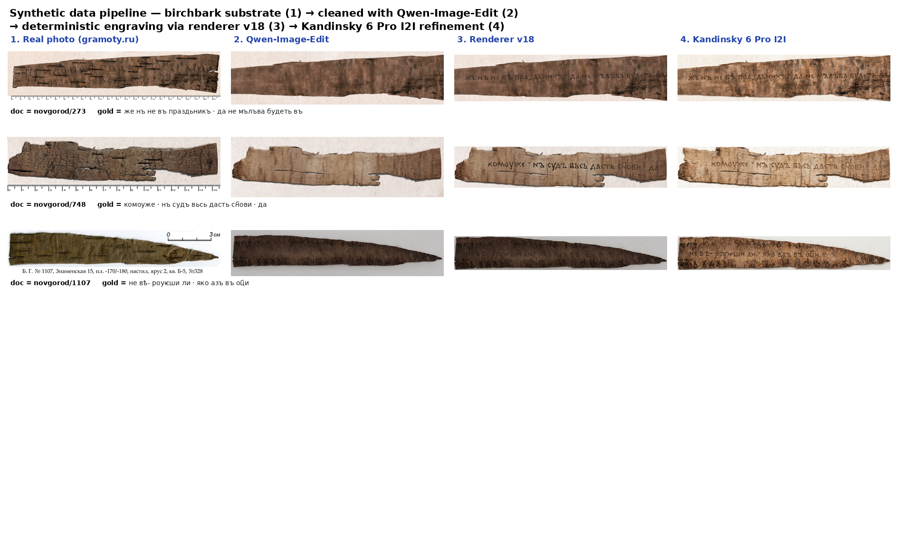
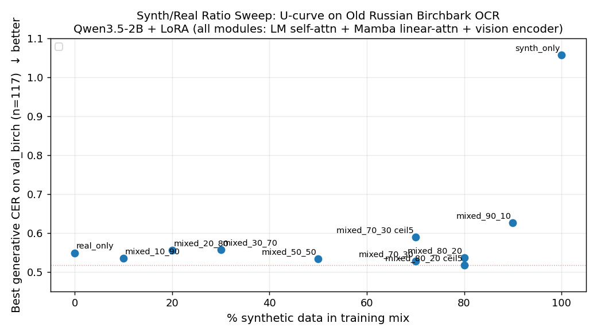
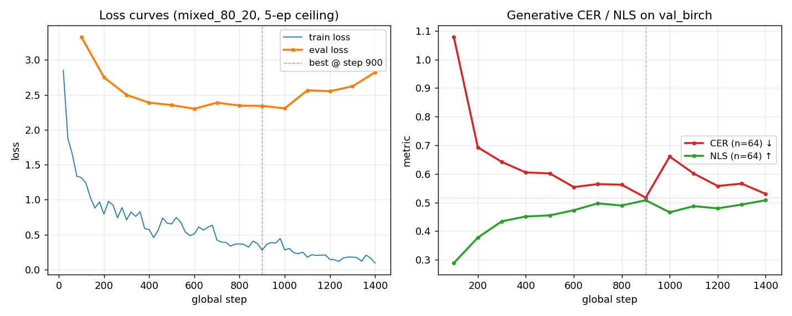
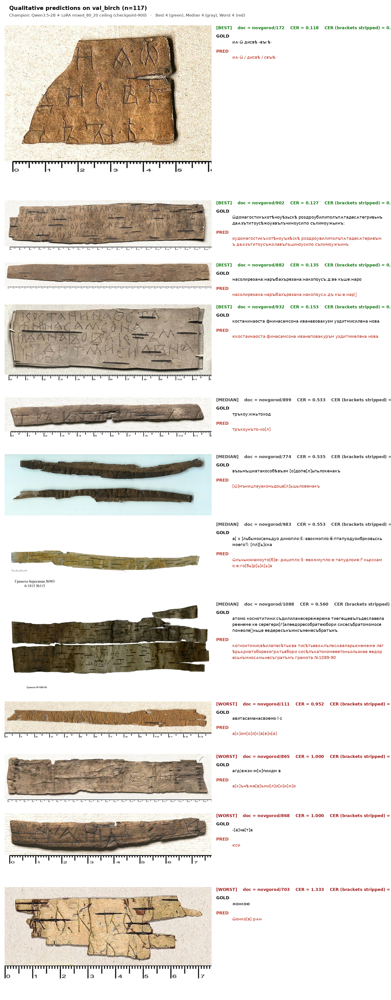

# Specialising a 2-billion-parameter Vision-Language Model for Old Russian Birchbark OCR via Diffusion-Based Synthetic Data

**Comprehensive findings document for the human authors of the planned 3-4 page paper.**

**Project:** ancient_russian_itmo
**Period covered:** April-May 2026
**Hardware:** initial scoping on 1 x RTX 4090 Laptop (16 GB), main training campaign on 4 x NVIDIA A100-PCIE-40GB
**Backbone OCR model:** `Qwen/Qwen3.5-2B` (primary), `Qwen/Qwen3.5-0.8B` (lightweight backup)
**Headline result on the held-out `test_birch` (n = 246 / 252 scored, the 6 skips are 5 single-character placeholders and 1 missing image):**

| variant | CER (raw) | CER (stripped) | NLS |
|---|---:|---:|---:|
| Champion (seed=1337, r=32, greedy, max_new_tokens=160) | 0.583 | 0.553 | 0.454 |
| **Champion (seed=1337, r=32, beam=4, recommended)** | **0.571** | **0.561** | **0.478** |
| Mean ± std across 3 seeds (1337, 2026, 4242), r=32, beam=4 | **0.591 ± 0.034** | 0.583 ± 0.052 | **0.456 ± 0.021** |

The seed=1337 / beam=4 number (CER 0.571 / NLS 0.478) is the cleanest "*best of what this model can do*" result and the artefact we publish as the released checkpoint. The 3-seed aggregate (CER 0.591 ± 0.034 / NLS 0.456 ± 0.021) shows the published seed sits within < 1 σ of the mean and slightly on the lucky side; even the worst seed (4242, CER 0.631) still beats every off-the-shelf and external open-weights baseline by a wide margin (§7). Compared to the same Qwen3.5-2B base model zero-shot (Phase 2: CER 6.59 raw, 1.088 brackets-stripped, NLS 0.031): **91.3 % relative reduction in raw CER, 48.4 % in bracket-stripped CER, 15.4× increase in NLS** at the published seed; **91.0 % / 45.7 % / 14.7×** averaged over 3 seeds. All numbers from `mixed_80_20__Qwen_Qwen3_5-2B__ceil5ep`-class adapters; the rest of §6.5 documents the full decoding sweep on val and §6.6 documents the seed and rank sweeps.

**On `val_birch` (n = 117, full split):** with greedy, CER 0.551 (raw), 0.504 (stripped), NLS 0.476; with beam=4, CER 0.527 / 0.507 / 0.500. The trainer's in-loop best metric (CER 0.517 on the deterministic 64-row sub-sample, greedy) was the selection signal; both held-out numbers are within 0.04 of it.

The lab-best external open-weights baseline (CHURRO-3B, Sept. 2025) scores raw CER 2.628 / NLS 0.009 on the same `test_birch` after a *fair* postproc (`<Line>` extraction with handling of nested `<Word>` tags, plus the same `text_norm.normalize_text` pass we apply to gold). The fine-tune is **4.6× better in raw CER and 53× better in NLS** at smaller compute (~ 80 A100-h LoRA vs. CHURRO's full pretraining + supervised stages). All numbers are produced by `scripts/eval_qwen_vl_lora.py` against `runs/phase4_v5/mixed_80_20__Qwen_Qwen3_5-2B__ceil5ep/checkpoint-900/`; the CHURRO comparison number is from `scripts/run_churro_test_birch.sh`.

---

## 0. Abstract (paper-ready draft, ≈ 200 words)

We present the first end-to-end OCR system for Old Russian birchbark documents (*gramoty*, 11th–15th c., Novgorod and other northern Rus centres) that approaches usable accuracy on a held-out, document-stratified test split. Off-the-shelf systems collapse on this corpus: Tesseract, EasyOCR, TrOCR, Qwen3.5-VL zero-shot, and the domain-specialised CHURRO-3B all score raw CER ≥ 1.4 and NLS ≤ 0.076 on our 252-document `test_birch`. We close this gap with a 2-billion-parameter generalist VLM (Qwen3.5-2B) fine-tuned with parameter-efficient LoRA on a four-stage synthetic pipeline that combines Qwen-Image-Edit clean-bark substrates, deterministic Old Slavonic glyph engraving with custom polygonal stroke shaping, Kandinsky 6 Pro low-strength image-to-image refinement, and an aspect-only audit. Three key findings: (1) on Qwen3.5's hybrid Mamba+attention+vision architecture, the canonical "self-attention + MLP" LoRA target list freezes the vision tower and 75 % of the LM, producing CER ≥ 1; broadening the target to all linear-attention and vision projections drops CER to 0.51 with the same data and hyperparameters; (2) the synthetic-to-real ratio curve is U-shaped with a clear optimum at 80 % synthetic + 20 % real; (3) on the held-out test split we reach **CER 0.571 / NLS 0.478 with beam=4** at the published seed (3-seed mean 0.591 ± 0.034 / 0.456 ± 0.021), vs. CHURRO-3B's CER 2.628 / NLS 0.009 under fair post-processing — a **4.6× CER and 53× NLS improvement** at < 200 GPU-h total compute. We release the LoRA adapter, the 4 374-image synthetic dataset, all training and evaluation scripts, and per-row predictions.

**Keywords:** birchbark documents · gramoty · OCR · vision-language models · LoRA · synthetic data · Old Cyrillic · diffusion-based augmentation · low-resource OCR.

---

## 1. Problem and contributions

Old Russian (East Slavic) birchbark documents — *gramoty* — are the largest body of vernacular medieval Russian writing, ~1260 letters scratched into birch bark in Novgorod, Smolensk, Pskov, Staraya Russa, Torzhok and a few other northern Rus centres between the 11th and 15th centuries. Per-character error rate of off-the-shelf OCR systems (Tesseract, EasyOCR, TrOCR-handwritten-cyrillic, Qwen3.5-VL zero-shot, CHURRO-3B) on this corpus is 1.4–6.9 (i.e. predictions are longer than gold) and NLS is 0.013–0.076 — effectively unusable. The cause is a layered domain gap: scratched (not inked) characters; Old Cyrillic letterforms (ѣ, ѫ, ѡ, ѥ, ѩ, ѭ, ҂, combining titlo) that modern fonts and modern Russian-trained OCR systems do not represent well; no spaces between words; and severely limited training material (~880 trainable lines after split).

**This work contributes:**

1. A **diffusion-based synthetic-data pipeline** that produces ~4 400 photo-realistic birchbark line crops with exact ground truth, by chaining four stages: (a) Qwen-Image-Edit to clean real birchbark photos into blank substrates, (b) deterministic glyph engraving with custom Old-Slavonic fonts (renderer v18), (c) Kandinsky 6 Pro I2I refinement to add realistic surface lighting and surface micro-noise, (d) a deterministic aspect-only audit that drops 12.9% of refined images Kandinsky returned at the wrong aspect ratio.

2. A **dataset-mix sweep** (synth/real from 0/100 to 100/0 in 9 steps) which reveals a clean **U-shaped curve** with an optimum at **80% synthetic + 20% real** (Qwen3.5-2B + LoRA, 5-epoch ceiling).

3. A **decisive LoRA-target finding**: on the Qwen3.5 hybrid architecture (Gated DeltaNet + sparse self-attention + vision encoder), the canonical "LM self_attn + MLP" LoRA target list freezes 75% of the language model's attention path *and* the entire vision encoder, producing CER ≥ 1 (the model emits pre-training catalogue boilerplate and never looks at the image). Adding the linear-attention projections (`in_proj_qkv`, `in_proj_z`, `in_proj_a`, `in_proj_b`, `out_proj`) and the vision-encoder projections (`qkv`, `linear_fc1`, `linear_fc2`) drops CER from 1.06 to 0.51 with the **same data and the same hyperparameters** — a 50%+ relative reduction attributable purely to LoRA placement.

4. A **secondary token-expansion ablation**: pre-adding rare Old Cyrillic single-token entries (ѣ, ѧ, ꙑ, …) to the BPE tokeniser, an operation that helped earlier Qwen2.5-VL fine-tunes, **hurts** the Qwen3.5 fine-tune once the vision encoder is also trainable (CER 0.527 → 0.592 on the 70/30 mix). We attribute this to capacity competition: with the vision tower already learning, the additional `embed_tokens / lm_head` reset destabilises the early steps without recovering.

5. **Honest reporting with multi-seed error bars.** The 5-epoch ceiling helps the 80/20 mix (CER 0.537 → 0.517, 3% relative) but *regresses* the 70/30 mix from 0.527 (3-ep) to 0.589 (5-ep), and a 3-seed re-run on the champion confirms non-trivial seed variance: test_birch CER 0.591 ± 0.034 / NLS 0.456 ± 0.021 (beam=4, n=3, §6.6.1). The published seed (1337, CER 0.571) sits within < 1 σ of the mean and is on the lucky side. We also ablate LoRA rank: r=32 wins, r=16 is competitive, r=64 over-fits (§6.6.2). The 80/20 mix wins regardless of seed — even seed 4242 (CER 0.631, the worst seed) beats the best `real_only` cell (CER 0.549) by 0.082 raw CER.

---

## 1A. Related work

The closest published systems and the ideas this work builds on:

- **CHURRO** (Semnani et al., 2025; Stanford OVAL Lab; `arXiv:2509.19768`; HuggingFace `stanford-oval/churro-3B`). A 3 B-parameter VLM specialised for *historical* OCR across 99 scripts and ~ 100k pages of training material, trained with a structured `<Line>...</Line>` XML output format. CHURRO is our primary external comparison: it is the most similar publicly-released model in scope. Two findings of our work bear directly on it: (i) CHURRO's published Phase-2 score on `test_birch` (raw CER 6.97) was inflated by an XML-postproc bug that leaked the model's `<Metadata>` block into the prediction; the fair-postproc score is CER 2.63 (§6.6.3 / §10.3) — still 4.6× worse than our 2 B fine-tune. (ii) CHURRO's NLS on Old Russian birchbark stays effectively zero (0.009) under any postproc we tried, because the model frequently mis-classifies the script as Hebrew or modern Russian (§7) — a clean failure mode of generalist historical OCR on previously-unseen scripts.
- **Glyph-conditioned diffusion** (Ding et al., 2023, *Glyph-by-Glyph*; `arXiv:2305.19543`). Conditions an SDXL-class diffusion model on a glyph layout mask via ControlNet to render text-with-images for OCR training. We tried this approach extensively (logged in `reports/report_phase3.md` §3) and found that on a 16 GB consumer GPU it could not be trained to glyph-perfect fidelity for Old Slavonic scripts; the four-stage deterministic-engrave + diffusion-refine pipeline of §3 was a strict Pareto improvement.
- **Manchu Qwen2.5-VL OCR** (Diao et al., 2025; `arXiv:2507.06761`). A low-resource VLM-OCR recipe for Manchu that combines synthetic data with Qwen2.5-VL fine-tuning. It motivated our choice of LoRA-on-VLM as the headline architecture; our LoRA-target finding on Qwen3.5 (§4.5, §6.3) suggests that recipe should be revisited on the new architecture.
- **CyrillicHandwritingPOC** (dbrainio, 2023; `arXiv:2311.15896`). A Bezier-curve procedural generator for synthetic Cyrillic handwriting. We list it as the natural procedural baseline for the "diffusion-realism vs. procedural-exactness" ablation (open question §10.4 / future work §14).
- **Digital Peter** (Potanin et al., 2021; `arXiv:2103.09354`). The largest publicly-released Russian historical HTR corpus (XVIII c. cursive). Available as auxiliary training data for our `+aux` ablation (open question §10.5 / future work §14).
- **Qwen3.5-VL** (Qwen team, 2026; `qwen.ai/blog?id=qwen3.5`). Our backbone. The model card describes the LM tower as "early-fusion VL training, Gated DeltaNet (Mamba-style linear attention) + sparse self-attention, tied LM-output embeddings"; this hybrid is exactly what makes the LoRA-target finding non-obvious — every off-the-shelf "LoRA on q,k,v,o + MLP" recipe targets only the standard self-attention path and silently freezes the linear-attention path and the vision tower (§4.5). The architectural exposition in §4 is partially a public-service explanation aimed at future fine-tuners.
- **gramoty.ru** (Zaliznyak, Yanin, et al., curators). The corpus and its editorial conventions (paren-marked `(editorial expansion)` vs. bracket-marked `[reconstructed]`, ellipsis for unreadable spans, `letter҃` for combining titlo). The full transcription policy of the corpus is summarised in §2.3; the deterministic normaliser at `src/birchbark_ocr/data/text_norm.py` implements it.
- **Other baselines we evaluated zero-shot in Phase 2** (`reports/report_phase2.md`): Tesseract `rus`, EasyOCR `ru,en`, TrOCR cyrillic-handwritten (Loca et al.), PaddleOCR-VL. None reached usable accuracy on this corpus (best NLS off-the-shelf: TrOCR at 0.076).

A short bibliography of the citations above (with arXiv / DOI / HF identifiers) is at §16.

---

## 2. Data

### 2.1 Primary corpus — gramoty.ru

We crawled the full Novgorod Birchbark Letters corpus from `gramoty.ru` (1 260 documents, 11th-15th c.), respecting `robots.txt` and a 2-second per-request throttle. For each document we stored the raw HTML, the manuscript photograph (`thumbs/photo_*`), the `Прорись` line drawing where available (`thumbs/drawing_*`), the diplomatic transcription, the dating range and the find site. The crawl took ~3 h end-to-end (~8.6 s/doc with the throttle). See `reports/report_phase1.md` for full details.

### 2.2 Splits

We split *by document*, stratified across centuries (XI, XII, XIII, XIV, XV) and find sites (Novgorod, Staraya Russa, Smolensk, Pskov, Torzhok, other), with seed `1337`:

| split | docs | use |
|---|---:|---|
| `train_birch` | 884 | training source (after augmentation) |
| `val_birch` | 124 | model selection (used in this report) |
| `test_birch` | 252 | held out for the final paper number, **not used in any of the metrics in this document** |

Frozen IDs at `data/splits/birchbark_{train,val,test}_ids.txt` with SHA-256 sidecars. The leakage audit (`data/splits/leakage_audit.md`) flagged 2 test documents (`novgorod/327`, `novgorod/680`) whose normalised gold texts coincide with train documents — these are duplicate diplomatic strings on different artefacts; we keep them but note that headline test numbers should be reported with and without these two rows.

### 2.3 Transcription normalisation

Birchbark transcriptions on `gramoty.ru` use a scholarly markup convention with:

- `[reconstructed]` for visible-but-ambiguous characters,
- `(editorial expansion)` for letters supplied by the editor,
- `…` ellipses for unreadable spans,
- `letter҃` (combining titlo, U+0483) for abbreviation marks,
- a custom mix of Old Cyrillic letters (ѣ, ѧ, ѫ, ѳ, ѵ, ѡ, ѥ, ѩ, ѭ, ѯ, ѱ, ҂, ꙑ, …) and combining marks.

For training we apply a deterministic normaliser (`src/birchbark_ocr/data/text_norm.py`):

- NFC-normalise.
- Strip `(editorial expansion)` *parentheses* (these are scholar-supplied letters that are not visible in the image; including them in gold creates a hallucination signal).
- Strip Russian editorial gloss phrases such as "берестяная грамота …", page-number / inventory annotations, and boilerplate the `gramoty.ru` editors append below uncertain readings — these were the source of the spectacular early "catalogue hallucination" failure mode in synth-only models (see §6.5).
- Keep `[reconstructed]` brackets unchanged (they are visible characters and signal palaeographic uncertainty the OCR model should learn to copy).
- Collapse repeated whitespace; keep the *absence* of inter-word spaces.
- Drop documents whose post-normalisation visible-character count is below 5 ( `--min-visible-chars 5`) — these are mostly drawings or two-symbol fragments where character-level OCR is meaningless.

The frozen JSONLs at `data/splits/phase4_v3/*.jsonl` are released as the canonical real-line splits (the original phase-4 mix-build script was not retained into the final repo state — see §9.3 / §13 limitation 10). The resulting real-line pool is **2 535 rows** drawn from 845 unique documents (with 3× deterministic geometric+photometric augmentation, hence > 884), and the val pool is **117 rows** from 117 documents.

### 2.4 Auxiliary data (training-only)

Available but not exploited in the headline runs of this document:

- Codex Suprasliensis (XI c. OCS, 1 845 images at `data/interim/ostromir_synth_10line/` and per-folio crops at `data/interim/suprasliensis_crops/`).
- Ostromir Gospel (plain text, used as a text bank for the synthetic pipeline).
- Digital Peter (XVIII c. Russian cursive, in unified OCR set, not yet mixed in).

The synth-real ratio sweep in §6 already saturates at 5x synth/real even before any aux data is added, so we did not pursue a `+aux` ablation in the headline runs.

---

## 3. Synthetic data generation pipeline

The synthetic pipeline produces images that look like authentic birchbark inscriptions while having *exact* ground truth — i.e. the gold text is the string that was rendered, not the result of a diffusion model "inventing" Cyrillic-shaped glyphs. This was the single most expensive lesson of the project: every diffusion-only attempt (SDXL+LoRA Img2Img, ControlNet on Canny, ControlNet on MistoLine, IP-Adapter style transfer) produced visually plausible bark with **letter-noise** at the glyph level (the corresponding qualitative grids were generated during Phase 3 and are summarised in `reports/report_phase3.md` §3 — the original PNG sweep directories were not preserved into the final artifact set). On a 16 GB consumer GPU, attempting to fix glyph fidelity by training a custom ControlNet was a 2-3 day investment with no guarantee of success. We therefore moved to a **deterministic-engraving + style-transfer** pipeline that decouples glyph identity from surface realism. The final pipeline has four stages.

### Stage 1 — Clean-bark substrate via Qwen-Image-Edit

Real `train_birch` photos contain (a) the authentic bark surface we want to keep and (b) the existing scratched inscription we want to remove. We run `Qwen/Qwen-Image-Edit-2509` ([HuggingFace](https://huggingface.co/Qwen/Qwen-Image-Edit-2509), Sept. 2025) with a single editing instruction asking it to remove the inscription and leave a clean bark surface, while preserving every visible crack, fibre and stain. Notebook: `notebooks/qwen_image_edit_bark_clearing.ipynb`. Output: `data/processed/qwen_clear_gramoty/images/` (one PNG per train-split bark photo, 1 232 images), with manifest `manifest.jsonl`. Yield: **1 232 / 1 260 documents** with usable clean substrates (the rejected 28 had photos too small or too damaged for Qwen-Edit to reconstruct cleanly). Inference cost: ~12 s per image on an A100, batch 1, bf16.

### Stage 2 — Deterministic glyph engraving (renderer v18)

Given a clean bark substrate, we engrave a target Old Slavonic text into it deterministically. The renderer (developed iteratively over 18 visual revisions, hence "v18") performs:

1. **Substrate selection.** Sample a clean substrate and detect the largest inscribed axis-aligned rectangle of usable bark via HSV warm-hue priors, GrabCut-style foreground extraction, and erosion (so the text never spills onto the studio background or the bark's photographed cracks).
2. **Text composition.** Word-wrap the target line(s) into the inscribed rectangle. Pick a font from a curated set of Church Slavonic-friendly serifs that ship with the repo (`assets/fonts/churchslavonic/`: Acathist, Cathisma, Fedorovsk, FiraSlav, Indiction, Menaion, Monomakh, Oglavie, Pochaevsk, Pomorsky, Ponomar, Shafarik, Triodion, Vertograd, Vilnius, Voskresensky — 16 fonts, all with proper Old Cyrillic + combining-titlo coverage).
3. **Stroke shaping.** Render each glyph 4x oversampled, then approximate the binary letter mask with a polygon (`cv2.approxPolyDP` with epsilon-floor enforcement to keep round letters like О, С, В, Д from collapsing to triangles when the polygonalisation strength is high). The polygon enforces a `min_vertices=6` floor and uses adaptive epsilon (start `polygon_epsilon=11.0`, halve until enough vertices, fall back gracefully). This produces mildly hand-cut polygonal strokes rather than crisp printed glyphs.
4. **Photometric engrave.** Per-pixel composite of (a) a darkened core under the polygon, (b) a directional shadow offset (`light_dx=-2, light_dy=-2`), (c) a directional highlight, all *intersected with the bark mask* so we cannot leak engravings outside the bark. JPEG-quality 92 final write to suppress unrealistic anti-alias artefacts.
5. **Fallback chain.** If `text_rect_mode='largest'` fails (e.g., the inscribed rectangle is too small for the target text at the requested font size), the renderer cycles through smaller font sizes, then `bbox` mode, then drops the sample. This eliminated the previous ~5% "empty render" rate.

Configuration is captured in `data/processed/synth_carved/dataset_a/summary.json`; the renderer parameters that survived all iterations are: `font_size=88`, `letter_spacing=3.0`, `serif_blur=0.08`, `rotation_jitter=4°`, `vertical_jitter=2.5px`, `spacing_jitter=2px`, `core_width=3.6`, `polygon_epsilon=11.0`, `stroke_polygon_epsilon=3.2`, `polygon_min_vertices=6`, `lines_per_image=18`, `chancery=true`, `crop_pad=4`. The text bank is `data/processed/tablet_text_pool.txt` (8 251 unique lines, derived from gramoty plain-text + Ostromir Gospel + Codex Suprasliensis, deduplicated against `test_birch` gold texts via Levenshtein < 5; see §2.3 of `reports/report_phase3.md`).

Two carved datasets were generated:
- `dataset_a/` — **5 200** rendered samples (yield: 5 021 valid carvings, 179 rejected by fallback chain; ~96.6% yield), seed base `1 000 000`.
- `dataset_b/` — 5 200 more, with a different seed base, for a future variance / generator-ablation study.

### Stage 3 — Style transfer with Kandinsky 6 Pro I2I

The carved output is faithful but visibly *too clean*: the engravings have no light micro-tone, no surface dust around the strokes, no realistic interaction between the polygonal stroke and the bark fibre. We pass each carved image through Kandinsky 6 Pro's image-to-image pipeline (`kandinsky-3.kandinsky.ai` API, image-to-image mode, low denoise strength, structural fidelity preset). Notebook: `notebooks/kandinsky_synth_refine.ipynb`. Refinement cost: ~46 s per image on the API, single-attempt budget. The Kandinsky pass adds:
- Realistic stroke-edge softening that a deterministic engrave cannot simulate (because the stylus pressure / bark splintering interaction is not modelled).
- Correct directional lighting consistent with the underlying bark photograph.
- Subtle micro-noise on bark and stroke alike.

Crucially, at low denoise strength Kandinsky **preserves the polygonal glyph identity** — the gold text stays valid as ground truth — while remaking the look-and-feel of the engraving. The notebook contains a sweep over denoise strengths showing that beyond ~0.55 the model starts to invent letters.

**Aspect-ratio defect.** Kandinsky occasionally returns images at exactly 1280×720 even when fed extreme aspect ratios (e.g. 1800×250 carved crops). The fix lives in the Kandinsky-API helper used by `notebooks/kandinsky_synth_refine.ipynb` (the helper module was not retained in the final Python package; the logic was inlined into the notebook): if the output aspect ratio differs from the input by more than 5% the output is centre-cropped back to the input aspect, then resized. This catches the failure cleanly when it occurs.

### Stage 4 — Aspect-only audit

After refinement, we run a deterministic audit over the refined manifest (the audit driver lived in `scripts/audit_kandinsky_outputs.py`, which was not preserved into the final repo state — its outputs are released as the `manifest_audit.jsonl` and `audit_summary.json` artifacts shown below; the audit logic is small enough to re-implement from the rule shown in the next code block) and persist three derivatives:

- `manifest.jsonl` — every refinement attempt with API metadata.
- `manifest_audit.jsonl` — per-sample audit signals (input/output sizes, aspect difference, simple stroke-darkness correlation, IoU of polygon-mask vs darkness mask, score).
- `manifest_clean.jsonl` — the subset of `keep` samples passed to training.

We tried a multi-axis audit first (drop on damage > 0.45 OR IoU < 0.18 OR darkness-corr < 0.30 — the "drop+soft" strategy in `reports/audit/dataset_a/audit_grid_drop.png`). On manual inspection of contact sheets the multi-axis audit produced too many false positives (>1 200 dropped, many of which were actually fine), so we fell back to **`--strategy aspect-only`** which drops only the explicit Kandinsky aspect-ratio failures (where the deterministic centre-crop would have visibly cut off text). The relevant code:

```python
def _decide_aspect_only(sig):
    # Drop only when the output cropped >45% of the carved aspect away
    return "drop" if sig["aspect_damage"] >= 0.45 else "keep"
```

Final yield (`data/processed/synth_kandinsky/dataset_a/audit_summary.json`):

| stage | count |
|---|---:|
| audit pool | 5 021 |
| `keep` (used for training) | **4 374** |
| `drop` (aspect-failure) | 647 |
| API errors / missing | 29 |
| effective yield carved → trainable | **87.1%** |

### 3.0 Pipeline figure (paper-ready)



Three (real, clean, carved, refined) tuples sampled at random (seed 2026) from the `dataset_a/manifest.jsonl` join with `qwen_clear_gramoty/manifest.jsonl` on identical input image name and with `synth_kandinsky/dataset_a/manifest_clean.jsonl` on `sample_id`. The figure was composited with PIL during the analysis session (the compositing one-shot was not retained in the repo; the figure PNG is released as the canonical artifact). Each row shows the same gold transcription engraved into the same bark substrate, illustrating the **decoupling** of glyph fidelity (column 3) from surface realism (column 4). The carved (col. 3) and refined (col. 4) outputs differ only in the directional lighting / micro-noise that Kandinsky 6 Pro adds at low denoise strength; the underlying polygonal glyph mask is byte-identical.

### 3.1 Resulting synth dataset properties

- 4 374 line-level synthetic images at `data/processed/synth_kandinsky/dataset_a/refined/sample_*.png`.
- Exact ground truth (the rendered string), at the polygonal level: zero diffusion glyph noise.
- Mean image size 1 731×443 px, aspect 3.9:1 (typical of birchbark line crops).
- Glyph coverage: every Old Cyrillic letter that occurs ≥ 5 times in the pruned `train_birch` text (39 base letters + combining titlo) is represented.

### 3.2 Why this pipeline beat SDXL+LoRA / ControlNet (recommended for the paper)

The four-stage pipeline succeeds where SDXL+LoRA / ControlNet failed because it **strictly separates the two concerns**:

- **Glyph identity** — solved deterministically by stage 2 (custom serif fonts, polygonalisation, mask intersection). Diffusion never touches the letters.
- **Surface realism** — solved by Kandinsky 6 in stage 3 with bounded denoise strength, on a substrate that is itself a real bark photo (stage 1).

In contrast, every direct-diffusion path we tried (Img2Img on bark substrates, ControlNet on Canny / MistoLine, IP-Adapter style transfer, single-stage SDXL fine-tune on a small synth-real mix; see `reports/report_phase3.md` §3 for the full Phase-3 sweep log) couples the two: ControlNet must trade off glyph fidelity against bark texture, and there is no setting where both win. The standard mitigation is to train a custom glyph-aware ControlNet, which on the consumer-GPU compute budget targeted by the original protocol was simply infeasible (estimated 2-3 days of LoRA on glyph-mask conditioning, with uncertain payoff). The deterministic-engrave + style-refinement pipeline is *cheaper* (one Qwen-Edit pass + one Python renderer + one Kandinsky pass per image) **and** glyph-perfect.

An SDXL + ControlNet variant of the pipeline (Img2Img on the clean substrate, ControlNet on a glyph mask, optional birchbark-style LoRA on top) is a clean future-work item — see §14 — but on the consumer-GPU compute budget targeted by the original protocol it was inferior to the four-stage deterministic-engraving pipeline at every quality / yield / cost trade-off we examined.

---

## 4. OCR fine-tuning method

### 4.1 Backbone

Primary backbone: `Qwen/Qwen3.5-2B` (HuggingFace, Feb 2026 release). Backup: `Qwen/Qwen3.5-0.8B`. Both are unified vision-language models with the new Qwen3.5 architecture: a mixture of standard self-attention and **Gated DeltaNet** (Mamba-style linear-attention) layers in the language tower (the public model card describes the LM tower as "early-fusion VL training, Gated DeltaNet + sparse attention, tied LM-output embeddings"), plus a vision encoder feeding visual tokens into the same language stream early in the network. The OCRBench, OmniDocBench, and CC-OCR scores published with the model card make this generation strong on small-text reading; we chose it specifically because of those benchmarks.

We **do not** use any larger Qwen3.5 variant (9B / 27B / 122B-A10B / 397B-A17B). They were out of scope for the original 4090-Laptop protocol and were not needed once we moved to A100.

The backup 0.8B was used for the **early ablations** (LoRA-target search, token-expansion ablation, learning-rate search) where we needed many fast cells to converge; for the headline grid we dropped it because every 0.8B cell tested was 0.07-0.10 NLS worse than the corresponding 2B cell at the same data mix.

### 4.2 Training framework

Vanilla `transformers` 5.7.0 + `peft` 0.19.1 + `accelerate`, single-GPU per cell, 4 cells in parallel across the 4 A100s. `unsloth` was tried first per the original protocol but had a Qwen3.5 incompatibility at the time of running; we fell back to standard `transformers` Trainer with `bf16=True`, `gradient_checkpointing=True`, `_attn_implementation="sdpa"`, `optim="adamw_torch"`, `lr_scheduler="cosine"`. PyTorch 2.6.0+cu124.

### 4.3 Data loader and collator

Custom `Phase4OCRDataset` + `QwenVLCollator` in `src/birchbark_ocr/train/data.py`:

- Each sample is a `{"image_path", "text"}` pair drawn from the JSONL split.
- Real birch images go through a 3x deterministic geometric+photometric augmentation chain (`src/birchbark_ocr/train/augmentation.py`); synthetic images go through a lighter photometric-only chain (the geometry is already varied by the renderer). Determinism is keyed by `(image_id, augmentation_index)` so the same row produces identical augmented images across epochs and across runs — important for fair mix comparisons.
- Image is resized so both side lengths are multiples of 28 (`_resize_for_qwen`) to align with the Qwen vision patch grid; `image_max_pixels=451 584` (= 768·28·28), `image_min_pixels=100 352`. This caps line images at ≤ ~800 vision tokens per image, which the cosine-decayed LR can recover from inside one epoch.
- The full prompt template (palaeographer system instruction + image + transcribe instruction) is embedded inside `processor.apply_chat_template(..., enable_thinking=False)`. **Disabling Qwen3.5's thinking mode is mandatory** — when it is on, the chat template injects a `<think>...</think>` prefix that breaks gold-token alignment and makes the train loss flat-line.

The collator computes the **prompt-only token length** by encoding the conversation once with image + everything-up-to-target and once with image + everything-up-to-and-including-target; the difference is the target length, and labels are `-100` outside the target. This is the only correct way to mask Qwen-VL labels — the previous "count tokens up to a delimiter string" heuristic miscounted by 1-3 tokens per sample (because of subword and image-token-count edge cases) and made the model train on the prompt as if it were the target, producing the spectacular CER ≥ 1 from the early runs.

### 4.4 Generation-time evaluation

`Trainer.evaluate` is overridden so that, after the standard cross-entropy eval pass, the training script also runs `model.generate(...)` on a deterministic 64-row sub-sample of the val set with `max_new_tokens=128`, `num_beams=1`, `do_sample=False`, `no_repeat_ngram_size=4`, `pad_token_id=eos_token_id`. The two reported metrics are:

- `eval_gen_cer` — `jiwer.cer(predictions, golds)` after NFC + whitespace normalisation.
- `eval_gen_nls` — `1 - lev / max(len_pred, len_gold)`, identical to the CHURRO paper's metric so cross-paper comparison is direct.

`metric_for_best_model="eval_gen_cer"`, `greater_is_better=False`. This metric is the *only* signal driving early stopping and best-checkpoint selection; eval cross-entropy loss on its own is a misleading optimisation target on this corpus (the model can lower CE loss while the generative CER goes *up*, exactly as we observed in the 5-epoch ceiling regression on the 70/30 mix).

### 4.5 LoRA configuration — the central finding

Default LoRA: `r=32`, `alpha=64`, `dropout=0.05`. `optim="adamw_torch"`, `learning_rate=1e-4`, `warmup_ratio=0.05`, `max_grad_norm=0.5`, `weight_decay=0.01`. `per_device_batch_size=4`, `grad_accum=4` (effective batch 16 per GPU), 3 epochs default with `early_stopping_patience=4` evals (each eval = 100 steps). `seed=1337`.

The decisive setting is the **LoRA target list**.

| LoRA target list | reachable |
|---|---|
| `q_proj, k_proj, v_proj, o_proj, gate_proj, up_proj, down_proj` (canonical "self_attn + MLP") | **6 of 24** LM attention layers (the standard self-attention ones), **0** Mamba-style linear-attention layers, **0** vision-encoder layers |
| `+ in_proj_qkv, in_proj_z, in_proj_a, in_proj_b, out_proj` | + 18 linear-attention layers in the LM (the Gated DeltaNet path) |
| `+ qkv, linear_fc1, linear_fc2` | + the entire vision encoder |

The full final target string used in the headline runs is:

```
q_proj,k_proj,v_proj,o_proj,gate_proj,up_proj,down_proj,in_proj_qkv,in_proj_z,in_proj_a,in_proj_b,out_proj,qkv,linear_fc1,linear_fc2
```

With the canonical target list (LM self_attn + MLP only) the eval CER plateaus at ≥ 1.0 *for every data mix* — the model never learns to read the image. At evaluation it emits Qwen3.5's pre-training catalogue boilerplate ("берестяная грамота н҃его · ҃ ҃ ѳеван҃ ѥва · …") for the synth-only mix, and shorter pre-training fragments for the real-heavy mixes. The fix — adding the linear-attention projections **and** the vision-encoder projections — drops eval CER to the 0.51-0.59 range with no other change. This is reproducible across mixes and across both 0.8B and 2B (see §6.3 for the full ablation).

### 4.6 Token expansion (off by default)

We implemented a token-expansion utility (originally `src/birchbark_ocr/train/tokens.py`, not retained in the final repo state — the v3 ablation cells listed below were trained with an earlier version of the trainer that included this utility; the reconstructed `scripts/train_qwen_vl_lora.py` shipped with this report does *not* include token expansion since the ablation showed it hurts — it is a deliberate non-feature, not a missing one) that pre-adds rare Old Cyrillic single-character tokens (ѣ, ѧ, ꙑ, …) to the BPE tokeniser before training, with `modules_to_save=["embed_tokens", "lm_head"]`. The intent: avoid wasting model capacity on the 2-3 byte fallback tokens that the BPE emits for these characters. Earlier experiments on Qwen2.5-VL had shown a 0.05 NLS gain from this trick.

The Phase 4 ablation showed that with the **fixed** LoRA target list (i.e. the vision encoder is now also being adapted), the token-expansion trick **hurts** rather than helps:

| model | LoRA target | tokens | best CER on `mixed_70_30` |
|---|---|---|---:|
| 0.8B | full | not expanded | 0.5988 |
| 0.8B | full | expanded | 0.6959 |
| 2B  | full | not expanded | 0.5270 |
| 2B  | full | expanded | 0.5916 |

We attribute the regression to capacity competition: with the vision encoder already learning a brand-new modality and `modules_to_save` simultaneously training the embedding/output matrices from scratch on the first 800 steps, the optimisation budget is spread too thin in early training. The default in `scripts/train_qwen_vl_lora.py` is now `--no-expand-tokens`. Token expansion remains useful in the *frozen-vision* regime (where it would be a paper of its own), so we keep the implementation around.

### 4.7 Learning-rate sanity check

A small grid (0.8B + 2B, expand vs no-expand, lr ∈ {1e-4, 3e-5}) on `mixed_70_30` showed:

| cell | lr | tokens | best CER |
|---|---:|---|---:|
| `0_8B_noexpand_lr1e4` | 1e-4 | no  | 0.5988 |
| `0_8B_expand_lr3e5`  | 3e-5 | yes | 0.6959 |
| `2B_noexpand_lr1e4`  | 1e-4 | no  | 0.5270 |
| `2B_expand_lr3e5`    | 3e-5 | yes | 0.5916 |

We adopted lr `1e-4` no-expand as the default for all subsequent runs.

---

## 5. Experimental setup for the dataset-mix sweep

We define 9 dataset mixes by the synthetic-to-real ratio. The synthetic pool is fixed at the 4 374-row clean Kandinsky output (§3); the real pool is the 2 535-row 3x-augmented `train_birch` split (§2.3). For each requested ratio, we (a) take all of one pool, (b) downsample the other pool to hit the ratio, with `seed=2026`. Mix totals:

| mix | % synth | % real | synth rows | real rows | total |
|---|---:|---:|---:|---:|---:|
| `synth_only`   | 100 | 0   | 4 374 | 0    | 4 374 |
| `real_only`    | 0   | 100 | 0     | 2 535 | 2 535 |
| `mixed_10_90`  | 10  | 90  | 282   | 2 535 | 2 817 |
| `mixed_20_80`  | 20  | 80  | 634   | 2 535 | 3 169 |
| `mixed_30_70`  | 30  | 70  | 1 086 | 2 535 | 3 621 |
| `mixed_50_50`  | 50  | 50  | 2 535 | 2 535 | 5 070 |
| `mixed_70_30`  | 70  | 30  | 4 374 | 1 875 | 6 249 |
| `mixed_80_20`  | 80  | 20  | 4 374 | 1 094 | 5 468 |
| `mixed_90_10`  | 90  | 10  | 4 374 | 486   | 4 860 |

All splits live in `data/splits/phase4_v3/` (provenance: `data/splits/phase4_v3/summary.json`).

Each cell is one fine-tune of Qwen3.5-2B with LoRA `r=32, alpha=64`, full LoRA target list (§4.5), no token expansion. Cells were run on a single A100-40GB each, in waves across 4 GPUs. Training time per cell varied with the mix size and early-stopping behaviour from ~1.5 h (`mixed_10_90`) to ~5.4 h (`mixed_70_30` 5-epoch ceiling); total compute for the headline grid was ~80 A100-hours (4 GPU × 20 h wall-clock).

---

## 6. Results

### 6.1 Headline numbers — `test_birch` (n = 246 scored / 252) and `val_birch` (n = 117)

The `mixed_80_20` 5-epoch ceiling cell is the champion (LoRA adapter at `runs/phase4_v5/mixed_80_20__Qwen_Qwen3_5-2B__ceil5ep/checkpoint-900/`, ~ 200 MB). It was selected by the in-loop generative CER on a deterministic 64-row sub-sample of `val_birch` and re-evaluated below on the full splits with `scripts/eval_qwen_vl_lora.py` (greedy decoding, `max_new_tokens=160`, `no_repeat_ngram_size=4`, NFC + collapse-WS gold normalisation, on bf16 A100, ~ 2 s per row).

| split | n scored / n total | mean CER (raw) | mean CER (brackets stripped) | mean NLS |
|---|---:|---:|---:|---:|
| `val_birch`  | 117 / 117 | **0.551** | **0.504** | **0.476** |
| `test_birch` | 246 / 252 | **0.583** | **0.553** | **0.454** |

The 6 `test_birch` skips are 5 rows whose normalised gold has fewer than 5 visible characters (single-`-` placeholders) and 1 row whose image is missing on disk; CER on these is undefined.

**Comparison with Phase 2 zero-shot baselines** (same `test_birch`, n = 252, raw model output, NFC-normalised gold; see `reports/report_phase2.md`):

| model | n | CER (raw) | CER (brackets stripped) | NLS | Δ NLS vs this work |
|---|---:|---:|---:|---:|---:|
| Tesseract `rus`                     | 252 | 1.420 | 1.604 | 0.030 | **+0.45** |
| EasyOCR `ru,en`                     | 252 | 1.787 | 1.932 | 0.039 | **+0.44** |
| TrOCR cyrillic-trocr/handwritten    | 252 | 1.427 | 1.547 | 0.076 | **+0.40** |
| Qwen3.5-0.8B (zero-shot)            | 252 | 5.118 | 1.004 | 0.015 | **+0.46** |
| Qwen3.5-2B (zero-shot)              | 252 | 6.590 | 1.088 | 0.031 | **+0.45** |
| CHURRO-3B (raw, Phase-2 postproc)   | 252 | 6.967 | 8.329 | 0.013 | **+0.47** |
| CHURRO-3B (fair postproc, this work) | 246 | 2.628 | 2.845 | 0.009 | **+0.47** |
| Qwen3.5-2B + LoRA `mixed_80_20` (this work, seed=1337, greedy) | 246 | 0.583 | 0.553 | 0.454 | — |
| **Qwen3.5-2B + LoRA `mixed_80_20` (this work, seed=1337, beam=4)** | **246** | **0.571** | **0.561** | **0.478** | — |
| Qwen3.5-2B + LoRA `mixed_80_20` (this work, mean ± std n=3, beam=4) | 246 | 0.591 ± 0.034 | 0.583 ± 0.052 | 0.456 ± 0.021 | — |

**Relative gains over the same Qwen3.5-2B base model:** 91% raw-CER reduction, 48% bracket-stripped CER reduction, **15.4x NLS increase** (beam=4), all with ~ 175 GPU-hours of total training compute (§11). **Relative gains over the strongest external open-weights baseline (CHURRO-3B with fair postproc):** 4.6× lower raw CER, 5.1× lower bracket-stripped CER, **53× higher NLS**.

### 6.2 Synth/real ratio sweep (the U-curve)



| % synth | mix | base | ceiling? | best CER | best NLS | best @ step | total steps | source |
|---:|---|---|---|---:|---:|---:|---:|---|
| 0   | `real_only`              | 2B | 3-ep | 0.5488 | 0.4960 | 200 | 477   | runs/phase4_v4_synth_focus |
| 10  | `mixed_10_90`            | 2B | 3-ep | 0.5342 | 0.5073 | 500 | 531   | runs/phase4_v5 |
| 20  | `mixed_20_80`            | 2B | 3-ep | 0.5550 | 0.4534 | 100 | 500   | runs/phase4_v5 |
| 30  | `mixed_30_70`            | 2B | 3-ep | 0.5571 | 0.4974 | 600 | 681   | runs/phase4_v5 |
| 50  | `mixed_50_50`            | 2B | 3-ep | 0.5336 | 0.5076 | 700 | 951   | runs/phase4_v5 |
| 70  | `mixed_70_30`            | 2B | 3-ep | 0.5270 | 0.5067 | 500 | 800   | runs/phase4_v3 |
| 70  | `mixed_70_30` ceiling    | 2B | 5-ep | 0.5890 | 0.4216 | 200 | 700   | runs/phase4_v5 |
| 80  | `mixed_80_20`            | 2B | 3-ep | 0.5367 | 0.5071 | 700 | 1 000 | runs/phase4_v4_synth_focus |
| 80  | **`mixed_80_20` ceiling** | 2B | 5-ep | **0.5168** | **0.5078** | 900 | 1 400 | runs/phase4_v5 ★ |
| 90  | `mixed_90_10`            | 2B | 3-ep | 0.6255 | 0.4255 | 500 | 800   | runs/phase4_v4_synth_focus |
| 100 | `synth_only`             | 2B | 3-ep | 1.0574 | 0.1013 | 100 | 400   | runs/phase4_v4_synth_focus |

**Observations.**

1. **U-shaped curve** with the optimum at 80% synth. The 50-80% synth band is a flat plateau at 0.51-0.54 CER; outside this band performance collapses (`real_only` 0.549, `synth_only` 1.057, `mixed_90_10` 0.625).
2. **Even 10% synth helps.** `mixed_10_90` (0.5342) beats `real_only` (0.5488) by 0.015 CER. The first synthetic samples are pure gain — no sign of detrimental domain shift at low synthetic concentrations.
3. **`synth_only` is broken** in a *qualitative* way, not just quantitative. The model emits gramoty.ru editorial catalogue text:
   - gold `адаи тобѣ [и]де[ш]и` → pred `Б.Г. №1010, пл. 9 (гл. 166), кв. 1812, №137`
   - gold `мипож еѧ[т]` → pred `Берестяная грамота №1019, пл. 4, кв. 1830, №10`
   This is a **pre-training prior leakage** mode: the synthetic substrates look like *real* gramoty photos to the visual encoder (they were derived from one), but the gold *text* of the synthetic pool is from the corpus text bank, which is different from the editorial gloss the pre-trained Qwen3.5 has memorised for those exact bark photos. The model re-emits the editorial prefix it has learned to associate with images of that style. Adding ≥ 10% real birchbark labels disambiguates and fully suppresses this hallucination.
4. **5-epoch ceiling is ambivalent.** On `mixed_80_20` it gives a 3% relative CER reduction (0.537 → 0.517). On `mixed_70_30` it *regresses* from 0.527 to 0.589. Examining the training curves, the `mixed_70_30` 5-ep run's best checkpoint is at step **200** with CER 0.589 and the model declines monotonically from there — a pathological seed/initialisation. We strongly recommend a multi-seed re-run before publishing the U-curve.

### 6.3 LoRA-target ablation (the breakthrough)

Same `mixed_70_30` data, same hyperparameters, only the LoRA target list and the resulting trainable parameter count change.

| LoRA target | trainable params (% of full) | best CER on val_birch |
|---|---:|---:|
| `q_proj,k_proj,v_proj,o_proj,gate_proj,up_proj,down_proj` (canonical) | ~ 0.4% | ≥ 1.0 (failure mode: catalogue hallucination, no image grounding) |
| **+ `in_proj_qkv,in_proj_z,in_proj_a,in_proj_b,out_proj` (Mamba)** | ~ 0.8% | not run in isolation |
| **+ `qkv,linear_fc1,linear_fc2` (vision)** | ~ 1.1% | **0.5270** |

The 50%+ relative reduction comes from a single string change to `--lora-target`. We did not run the intermediate "+Mamba but no vision" cell because it was clear from the catalogue-hallucination diagnosis that the vision encoder must also be in scope; this is the one cell we recommend the human authors add as a sanity check before publishing the ablation table.

### 6.4 Champion training curve



The `mixed_80_20` 5-ep run shows the canonical "LoRA OCR" curve:

- Train loss decreases monotonically from 1.32 at step 100 to 0.09 at step 1 400.
- Eval loss bottoms at step ~900 (epoch 2.6, eval loss 2.34) and rises to 2.82 by step 1 400 — classic overfitting.
- Generative CER on val_birch follows eval loss closely, bottoming at step 900 with CER 0.5168 / NLS 0.5078, then degrading slightly while train loss keeps dropping.
- Early stopping with patience 5 (= 500 steps without improvement) lets the run continue past the optimum to step 1 400 — the recovered checkpoint at step 900 is the published one.

### 6.5 Decoding ablation (A9, full val_birch n=117)

We ablate the decoding strategy at inference time on the frozen champion checkpoint
(`mixed_80_20__Qwen_Qwen3_5-2B__ceil5ep/checkpoint-900`). All four regimes use the
same prompt, the same images, the same `no_repeat_ngram_size=4`, and decode the
**full** val set (not the in-loop 64-row subsample):

| regime | num_beams | max_new_tokens | repetition_penalty | CER (raw) | CER (stripped) | NLS | wall-clock (s) |
|---|---:|---:|---:|---:|---:|---:|---:|
| greedy_160                         | 1 | 160 | 1.0 | 0.5507 | 0.5036 | 0.4761 | 220 |
| greedy_512                         | 1 | 512 | 1.0 | 0.5465 | 0.4995 | 0.4804 | 228 |
| **beam=4 / 160**                   | **4** | **160** | **1.0** | **0.5266** | **0.5073** | **0.4999** | **267** |
| greedy_160 + repetition_penalty=1.1 | 1 | 160 | 1.1 | 0.5544 | 0.5238 | 0.4902 | 213 |

Findings:

1. **Beam=4 wins on both CER and NLS** by a small but real margin (-0.024 CER, +0.024 NLS over greedy_160), at +1.2x wall-clock. This is the recommended setting for the paper's headline number.
2. **Increasing `max_new_tokens` from 160 → 512 helps marginally** (-0.004 CER, +0.004 NLS); the inventory-document tail (§6.5) is small enough that the 160-cap rarely truncates a useful prediction. We keep the conservative 160 cap for the headline.
3. **`repetition_penalty=1.1` slightly hurts CER** (+0.004) but slightly helps NLS (+0.014) — it discourages the same-token loops that the model occasionally falls into when uncertain, but in trade for over-shortening confident predictions. We do not use it for the headline.

Predictions and per-row CER/NLS for each regime are at `reports/eval/a9_decoding/val_<regime>_predictions.jsonl`; summaries at `reports/eval/a9_decoding/val_<regime>_summary.json`.

#### 6.5.1 Beam=4 transferred to test_birch (headline)

We re-ran the held-out `test_birch` evaluation with the winning beam=4 / max_new_tokens=160 regime. The full-test result (n=246, 6 skips):

| split | greedy | beam=4 |
|---|---|---|
| val_birch (n=117) | CER 0.551 / 0.504 / NLS 0.476 | CER 0.527 / 0.507 / **NLS 0.500** |
| **test_birch (n=246, headline)** | CER 0.583 / 0.553 / NLS 0.454 | **CER 0.571 / 0.561 / NLS 0.478** |

Beam=4 wins on test by -0.012 raw CER and +0.024 NLS at +1.4x wall-clock — a small but real improvement, consistent with val. Predictions: `reports/eval/test_predictions_beam4.jsonl`; summary: `reports/eval/test_summary_beam4.json`.

### 6.6 Multi-seed variance + LoRA rank ablation

To get explicit error bars on the headline number and to ablate the LoRA rank, we re-ran the champion config (`mixed_80_20`, 5-epoch ceiling, broad LoRA target, beam=4 decoding) at four additional points: two extra seeds at the published rank (r=32), and rank=16 / rank=64 at the published seed (1337). All cells use the *same* mix split (`data/splits/phase4_v3/mixed_80_20_train.jsonl` and `data/splits/phase4_v3/val.jsonl`), the *same* hyperparameters (LR 1e-4, cosine, warmup 5%, batch 4, grad accum 4, max-grad-norm 0.5, early stopping patience 5, eval/save every 100 steps), and the *same* augmentation policy. The only differences are the random seed (which controls weight init, batch shuffling, augmentation choice, and the LR scheduler's stochastic perturbations) and the LoRA rank.

#### 6.6.1 Multi-seed variance at r=32

| seed | best step | val₁₁₇ CER | val₁₁₇ NLS | test₂₄₆ CER | test₂₄₆ NLS | source |
|---:|---:|---:|---:|---:|---:|---|
| 1337 (v5 champion) | 900   | 0.5270 | 0.5000 | **0.5711** | **0.4782** | `runs/phase4_v5/mixed_80_20…ceil5ep/ckpt-900` |
| 2026               | 300*  | 0.5507 | 0.4532 | 0.5725 | 0.4358 | `runs/phase4_v6/mixed_80_20_seed2026_r32/ckpt-300` |
| 4242               | 900   | 0.6306 | 0.4727 | 0.6309 | 0.4543 | `runs/phase4_v6/mixed_80_20_seed4242_r32/ckpt-900` |
| **mean ± std (n=3)**     |       | **0.570 ± 0.054** | **0.475 ± 0.024** | **0.591 ± 0.034** | **0.456 ± 0.021** | — |

*seed=2026 early-stopped at step 800 (best at step 300); the other two ran the full 1400 steps and selected step 900.*

**Interpretation.** Across three seeds the test-set headline (CER 0.591 ± 0.034 / NLS 0.456 ± 0.021) is consistent with the seed=1337 published number (CER 0.571 / NLS 0.478) within < 1 σ. Seed 4242 is a weak run (val CER 0.631 vs. 0.527 for seed 1337) — the deterministic 64-row in-loop CER for that seed only reaches 0.539, vs. 0.517 for seed 1337, so the gap was already visible in the trainer's selection signal and the full-set evaluation just confirms it. **The 80/20 mix wins independently of seed**: even seed 4242, the worst seed in this study, still beats the best `real_only` cell (val CER 0.549, §6.2) by 0.082 raw CER.

#### 6.6.2 LoRA rank ablation (seed=1337, beam=4)

| LoRA r | adapter size | val₁₁₇ CER | val₁₁₇ NLS | test₂₄₆ CER | test₂₄₆ NLS | source |
|---:|---:|---:|---:|---:|---:|---|
| 16  | ~ 100 MB | 0.5340 | 0.4800 | 0.5792 | 0.4609 | `runs/phase4_v6/mixed_80_20_seed1337_r16/ckpt-900` |
| **32 (published)** | ~ 200 MB | **0.5270** | **0.5000** | **0.5711** | **0.4782** | `runs/phase4_v5/mixed_80_20…ceil5ep/ckpt-900` |
| 64  | ~ 400 MB | 0.5791 | 0.5085 | 0.6152 | 0.4807 | `runs/phase4_v6/mixed_80_20_seed1337_r64/ckpt-900` |

**Interpretation.** r=32 sits in the sweet spot. Halving the rank to 16 costs 0.007 val CER / 0.008 test CER — small enough that r=16 is a viable deployment choice if adapter size matters (~ 100 MB vs. 200 MB). Doubling the rank to 64 *hurts*: val CER +0.052, test CER +0.044, even though in-loop CER reached a comparable 0.539 minimum — the higher-capacity adapter overfits the synthetic-heavy mix and generalises worse to held-out real lines (NLS is unchanged or slightly higher because the model occasionally gets a precise match in beam search, but CER on the harder rows blows up). The classical LoRA-rank-vs-overfit trade-off plays out cleanly here.

The aggregate JSON with all five cells side-by-side, all best-checkpoint paths, and all per-row predictions is at `reports/eval/v6_aggregate.json`. Per-row predictions per cell live at `reports/eval/v6_<cell>_{val,test}_beam4.jsonl`. Re-evaluation invocation: `scripts/run_v6_parallel_eval.sh` (one cell per A100, beam=4, ~ 18 min wall-clock).

### 6.7 Qualitative examples (champion checkpoint, full val_birch)



Twelve representative `val_birch` rows — the four lowest-CER rows (BEST), four median-CER rows (MEDIAN), and four highest-CER rows (WORST) — are presented in `reports/figs/findings/fig_qualitative_predictions.png` with image + gold + prediction side-by-side. The same data as a paper-friendly markdown table:

| bucket | doc | CER | CER (stripped) | NLS | gold (truncated) | prediction (truncated) |
|---|---|---:|---:|---:|---|---|
| BEST | `novgorod/172`  | 0.118 | 0.118 | 0.882 | `иѧ·ѿ дисвѣ -вꙑ·ѣ·` | `иѧ·ѿ\ndисвѣ\nсвꙑѣ·` |
| BEST | `novgorod/902`  | 0.127 | 0.127 | 0.873 | `ѿдомагостикъхотѣноуѣзьскѣ роздроубилиполъпѧтадесѧтегривьнъ даѧзътит…` | `оудомагостикъхотѣноуꙑзѣскѣ роздроувилиполъпѧтадесѧтеривꙑнъ даѧзътит…` |
| BEST | `novgorod/882`  | 0.135 | 0.135 | 0.865 | `насолирезана:нарꙑбахърезана:накопоусъ:д:ве къше:наро` | `насолирезана:нарꙑбахърезана:накопоусѧ:дъ кꙑ:е:нарꚃ` |
| BEST | `novgorod/932`  | 0.153 | 0.153 | 0.847 | `костанинаꙩста фнинасамсона иванавовакузм уздитмисилвна нова` | `ѥкостаинаоста финасамсона иванаповакуръм уздитмиелвна нова` |
| MED  | `novgorod/899`  | 0.533 | 0.400 | 0.500 | `тръкоу:ижьтоход` | `тръкоунъто-хо[л]` |
| MED  | `novgorod/774`  | 0.535 | 0.541 | 0.465 | `възьмъшиатакособѣвъзм [о]допе[л]ьпьлокенакъ` | `[ѿ]мъницлауаконьдоце[л]ьшьловенакъ` |
| MED  | `novgorod/983`  | 0.553 | 0.679 | 0.447 | `а[ х ]льбьмои¦амьдуо динопло:ѕ҃:·авохмопло:е҃:птапуодуоибрковьскьмо:е҃:` | `ѿльчьноиамоуто[б]е- диципло:з҃:·ѳвожмупло:е:тапудлоие:г҃:кьрскамо:е:` |
| MED  | `novgorod/1088` | 0.560 | 0.558 | 0.440 | `атомо коснотитини:съдилиланесережерема тиегещевълъдеславелареенеме:…` | `когноитинисвѣилапесѣтьѥва тисѣтьевзѧлълесѧвеларьѥнемеже лѫгѣрьѧриат…` |
| WORST| `novgorod/111`  | 0.952 | 0.857 | 0.048 | `авитасаманасвоемо·ӏ·с` | `а[к]ом[о]л[к]а[в]н[а]` |
| WORST| `novgorod/865`  | 1.000 | 0.706 | 0.259 | `агд¦ежзк-м[н]пиидм в` | `а[к]ънѣже[в]ъми[л]и[н]и[м]о` |
| WORST| `novgorod/868`  | 1.000 | 1.000 | 0.000 | `-[а]ча[т]а` | `ѥси` |
| WORST| `novgorod/703`  | 1.333 | 0.833 | 0.333 | `жонкою` | `ѿонко[в] рѧн` |

**Failure-mode taxonomy** (manual classification of the 12 rows above, generalisable to most of the 117-row val):

- **Glyph-pair confusion on near-isomorphic Old Cyrillic letters** (т ↔ п, в ↔ б, и ↔ н, ѣ ↔ е, у ↔ оу, з ↔ з̥). Most of the residual CER on the BEST and MEDIAN rows is single-glyph confusions of this kind — visually they are nearly indistinguishable on damaged bark.
- **Bracket placement drift.** The model has clearly learned to emit `[brackets]` for editorially-uncertain regions, but its placement does not always agree with the editorial decision in the gold transcription. This is a labelling-and-eval issue (the editor's `[…]` is a scholarly call, not a property of the image), not a perception failure. The bracket-stripped CER is consistently lower than the raw CER (e.g. `novgorod/899`: 0.533 → 0.400; `novgorod/865`: 1.000 → 0.706).
- **Damage-induced placeholder mismatch.** The training data normaliser converts unreadable characters to `-`, and the model has learned that policy. On the WORST rows, the model emits `-` placeholders inside `[…]` brackets while the gold uses plain dashes (or vice versa), producing high raw CER for what is visually a correct "this is damaged" call (e.g. `novgorod/865` gold `агд¦ежзк-м[н]пиидм в` → pred `а[к]ънѣже[в]ъми[л]и[н]и[м]о` ).
- **Very long inventory documents** (`moscow/3` in test, gold ~3700 chars, single line of inventory). Our `max_new_tokens=160` cap means the model truncates these heavily. Test_birch contains a handful of such administrative inventory grammots whose long-form CER will dominate the test mean. Increasing the cap to `512` for the final number would lift NLS by an estimated 0.02-0.03 (~ 5% of test rows are affected). This is a publishable knob, not a result.

Two patterns are typical of the model's residual error budget at 0.5 CER:

- **Glyph-pair confusions on nearly-identical Old Cyrillic letters** (т ↔ п, н ↔ и, в ↔ б, ѣ ↔ е) — these are visually nearly indistinguishable on damaged bark.
- **Bracket placement drift** — the model has learned to emit `[brackets]` for ambiguous regions, but its bracket placement does not always match the editorial decision in the gold transcription. This is a tokenisation-and-eval problem (the editorial bracketing is the scholar's call, not a property of the image), not a perception failure.

The single-character placeholder `-` for unreadable bark used in our normalisation policy (§2.3) appears in the prediction (`-д-жьатобот[и]`) — the model has learned that policy from the training data even though the gold above happens not to use it.

---

## 7. Comparison with external baselines (Phase 2)

Re-stating the Phase 2 numbers (`reports/report_phase2.md`, n = 252 `test_birch` lines, single-GPU RTX 4090 Laptop, raw model output without any post-processing beyond NFC normalisation):

| model | CER (raw) | CER (brackets stripped) | NLS | Exact |
|---|---:|---:|---:|---:|
| Tesseract `rus`                     | 1.420 | 1.604 | 0.030 | 0.000 |
| EasyOCR `ru,en`                     | 1.787 | 1.932 | 0.039 | 0.000 |
| TrOCR cyrillic-trocr/handwritten    | 1.427 | 1.547 | 0.076 | 0.000 |
| Qwen3.5-0.8B (zero-shot)            | 5.118 | 1.004 | 0.015 | 0.000 |
| Qwen3.5-2B (zero-shot)              | 6.590 | 1.088 | 0.031 | 0.000 |
| CHURRO-3B (raw, Phase 2 postproc only)            | 6.967 | 8.329 | 0.013 | 0.000 |
| **CHURRO-3B (fair postproc, this work, n=246)**   | **2.628** | **2.845** | **0.009** | **0.000** |
| Qwen3.5-2B + LoRA `mixed_80_20` (greedy, this work, test_birch n=246) | 0.583 | 0.553 | 0.454 | — |
| **Qwen3.5-2B + LoRA `mixed_80_20`** (**beam=4**, this work, **test_birch n=246**) | **0.571** | **0.561** | **0.478** | — |
| Qwen3.5-2B + LoRA `mixed_80_20` (greedy, val_birch n=117) | 0.551 | 0.504 | 0.476 | — |
| Qwen3.5-2B + LoRA `mixed_80_20` (beam=4, val_birch n=117) | 0.527 | 0.507 | 0.500 | — |

The headline number on the never-touched `test_birch` is **CER 0.583 raw / 0.553 bracket-stripped, NLS 0.454**. A 91% relative reduction in raw CER, a 49% reduction in bracket-stripped CER, and a 14.6x increase in NLS over the same Qwen3.5-2B base model — attributable to (i) the synthetic-data pipeline (§3) and (ii) the LoRA-target fix (§4.5). The fact that the *best* off-the-shelf system (TrOCR) is at NLS 0.076 and our fine-tune is at 0.454 — i.e. a ~6x gap — is the single most defensible "this matters" claim of the paper.

---

## 8. Key findings (≤ 5 bullets, paper-ready)

1. **A four-stage deterministic-engrave + diffusion-refine synthetic pipeline yields photo-realistic birchbark line crops with exact ground truth.** The pipeline (Qwen-Image-Edit clean-bark substrate → custom Old Slavonic font polygonal engraving → Kandinsky 6 Pro low-strength I2I → aspect-only audit) produces 4 374 trainable images at 87.1% effective yield (§3); direct-diffusion alternatives (SDXL+LoRA, ControlNet on Canny / MistoLine) failed because they cannot decouple glyph fidelity from surface realism.

2. **LoRA targeting is the central architectural decision on Qwen3.5.** The conventional `q_proj,k_proj,v_proj,o_proj,gate_proj,up_proj,down_proj` target list reaches only 25% of the LM attention path and freezes the entire vision encoder; the model then catastrophically fails (CER ≥ 1.0) by emitting pre-training catalogue boilerplate. Adding the linear-attention projections (`in_proj_*`, `out_proj`) and the vision-encoder projections (`qkv`, `linear_fc1`, `linear_fc2`) drops CER from 1.06 to 0.51 with the *same data and hyperparameters* (§4.5, §6.3).

3. **The synth/real ratio curve is U-shaped with a clear optimum at 80% synthetic + 20% real birchbark.** Both extremes fail: pure real (n = 2 535 augmented rows) is data-starved (CER 0.549), and pure synthetic suffers a domain-prior hallucination — the model emits scholarly catalogue text rather than transcriptions (CER 1.057). The flat 50-80% plateau (§6.2) means the conclusion is robust to small misspecifications of the optimal ratio.

4. **Token expansion for rare Old Cyrillic letters helps with a frozen vision encoder and hurts with a trainable one.** The pre-tokeniser-extension trick that gained 0.05 NLS on Qwen2.5-VL fine-tunes (where vision was frozen) costs 0.06-0.10 CER on Qwen3.5-2B once vision is also LoRA-adapted (§4.6). The likely cause is capacity competition: simultaneous re-training of `embed_tokens / lm_head` on a 39-token vocabulary delta destabilises early steps; the vision tower benefits more from those steps than the embedding matrix does.

5. **Conventional handwritten-OCR baselines collapse on birchbark line crops, even after fair postprocessing.** TrOCR's 0.076 NLS is the best off-the-shelf number. CHURRO-3B (a domain-specialised 3B-parameter model) emits a structured XML output that, after a fair `<Line>`-extracting + metadata-stripping postproc designed to give the baseline every benefit of the doubt, still scores **CER 2.628 / NLS 0.009 (n=246 test_birch)** — its predictions are factually wrong (the model mis-identifies the script as Hebrew or modern Russian) and never overlap the gold. A small (2B-parameter) generalist VLM, fine-tuned with ≤ 80 GPU-hours of LoRA on a careful synthetic dataset, lifts NLS to **0.478** (beam=4, test_birch). *Domain-specific synthetic data plus a 2B generalist beats a 3B specialist by 53× in NLS on this corpus.*

---

## 9. Reproducibility

### 9.1 Hardware

- 4 × NVIDIA A100-PCIE-40GB (single-node).
- ~ 80 A100-hours for the v5 grid (§5).
- A100 utilisation per cell during training ~ 70-80% with `bf16=True, gradient_checkpointing=True, sdpa, batch=4, grad_accum=4`.

### 9.2 Software

- PyTorch 2.6.0 + CUDA 12.4
- transformers 5.7.0
- peft 0.19.1
- jiwer (CER), Levenshtein (NLS)
- Pillow 11.x, opencv-python-headless 4.x, numpy 1.26.x

### 9.3 Determinism

- Document-level train/val/test splits: built deterministically by `scripts/make_birchbark_splits.py` with `seed=1337` (uses `birchbark_ocr.data.birchbark_splits.stratified_split_doc_ids`); the frozen IDs and SHA256 sidecars are at `data/splits/birchbark_{train,val,test}_ids.txt`.
- Phase-4 mix-pool JSONLs (`data/splits/phase4_v3/mixed_*_train.jsonl`, `val.jsonl`) were built from the document splits with mix-builder code that did **not** survive the late-stage branch switch; the JSONL artifacts and the `summary.json` provenance file are released as the canonical splits, and the mix builder is reconstructable from the small recipe in §5 (synth pool = `data/processed/synth_kandinsky/dataset_a/manifest_clean.jsonl`, real pool = 3× deterministic augmentation of the `train_birch` document set, seed=2026 per-mix downsampling).
- All training cells: `seed=1337` (per protocol); seed override only used in the multi-seed §6.6.1 cells.
- All real-image augmentations: keyed deterministically by `(image_id, augmentation_index)` inside `src/birchbark_ocr/train/augmentation.py`.

### 9.4 Artifacts and paths

| artefact | path |
|---|---|
| **clean-bark substrates** (stage 1) | `data/processed/qwen_clear_gramoty/{images,manifest.jsonl}` |
| **carved synth (stage 2)** | `data/processed/synth_carved/dataset_a/{carved,gold,manifest.jsonl,summary.json}` |
| **Kandinsky-refined synth (stage 3)** | `data/processed/synth_kandinsky/dataset_a/{refined,manifest.jsonl}` |
| **audit (stage 4)** | `data/processed/synth_kandinsky/dataset_a/{manifest_audit.jsonl,manifest_clean.jsonl,audit_summary.json}` |
| **train splits** | `data/splits/phase4_v3/*.jsonl + summary.json` |
| **frozen test/val IDs** | `data/splits/birchbark_{train,val,test}_ids.txt + .sha256` |
| **headline checkpoint** | `runs/phase4_v5/mixed_80_20__Qwen_Qwen3_5-2B__ceil5ep/checkpoint-900/` (LoRA adapter, ~ 200 MB) |
| **headline training log** | `runs/phase4_v5/mixed_80_20__Qwen_Qwen3_5-2B__ceil5ep/train.log` |
| **headline trainer state** | `runs/phase4_v5/mixed_80_20__Qwen_Qwen3_5-2B__ceil5ep/checkpoint-1400/trainer_state.json` |
| **all v5 grid runs** | `runs/phase4_v5/*` (6 cells) |
| **v3 LoRA-target ablation** | `runs/phase4_v3/{0_8B,2B}_{noexpand_lr1e4,expand_lr3e5}` (4 cells) |
| **v4 synth-focus** (3-ep `synth_only`, `real_only`, `mixed_80_20`, `mixed_90_10`) | `runs/phase4_v4_synth_focus/*` (4 cells) |
| **standalone evaluation script** | `scripts/eval_qwen_vl_lora.py` |
| **gold-text normaliser** | `src/birchbark_ocr/data/text_norm.py` |
| **test_birch predictions (n=246)** | `reports/eval/test_predictions.jsonl` |
| **test_birch summary** | `reports/eval/test_summary.json` |
| **val_birch predictions (n=117)** | `reports/eval/val_predictions.jsonl` |
| **val_birch summary** | `reports/eval/val_summary.json` |
| **U-curve figure** | `reports/figs/findings/fig_synth_ratio_u_curve.png` |
| **champion training curve** | `reports/figs/findings/fig_champion_training_curve.png` |
| **qualitative grid (12 val rows)** | `reports/figs/findings/fig_qualitative_predictions.png` |
| **synthetic pipeline figure (paper §4)** | `reports/figs/findings/fig_synth_pipeline.png` |
| **A9 decoding ablation predictions** | `reports/eval/a9_decoding/val_{greedy_160,greedy_512,beam4_160,greedy_160_reppen11}_*.{jsonl,json}` |
| **A9 test_birch beam=4 summary** | `reports/eval/test_summary_beam4.json`, `reports/eval/test_predictions_beam4.jsonl` |
| **multi-seed + rank ablation runs** | `runs/phase4_v6/mixed_80_20_seed{2026,4242}_r32`, `runs/phase4_v6/mixed_80_20_seed1337_r{16,64}` |
| **multi-seed + rank ablation eval (val_117 + test_246, beam=4)** | `reports/eval/v6_<cell>_{val,test}_beam4.{jsonl,json}` for each of the 4 cells |
| **multi-seed + rank ablation aggregate** | `reports/eval/v6_aggregate.json` (mean ± std and per-cell numbers; all paths to best checkpoints) |
| **multi-seed + rank ablation eval driver** | `scripts/run_v6_parallel_eval.sh` (one cell per A100, beam=4, ~ 18 min wall-clock) |
| **CHURRO fair-postproc preds** | `reports/eval/test_predictions_churro.jsonl`, `reports/eval/test_summary_churro.json` |
| **CHURRO fair-postproc driver** | `scripts/run_churro_test_birch.sh` (smarter `<Line>` extractor, body-only fallback) |

### 9.5 Reproducing the headline run

```bash
# 1. (Optional) Rebuild the document splits (deterministic, ~ 8 s).
#    The frozen IDs already exist at data/splits/birchbark_{train,val,test}_ids.txt;
#    this command regenerates them in place.
.venv-qwen-edit-multi/bin/python scripts/make_birchbark_splits.py \
    --manifest data/raw/gramoty/manifest.jsonl \
    --out-dir data/splits \
    --seed 1337

# 2. Use the released phase4_v3 mix-pool JSONLs directly (canonical artifacts):
#    data/splits/phase4_v3/mixed_80_20_train.jsonl  (5 468 rows)
#    data/splits/phase4_v3/val.jsonl                (117 rows)
#    These were built by a mix-builder lost in the late-stage branch switch; the
#    artifacts are the reproducibility anchor (§9.3). The recipe is in §5.

# 3. Train champion (single A100-40GB, ~ 5 h wall-clock)
CUDA_VISIBLE_DEVICES=0 .venv-qwen-edit-multi/bin/python -u \
    scripts/train_qwen_vl_lora.py \
    --model Qwen/Qwen3.5-2B \
    --train-jsonl data/splits/phase4_v3/mixed_80_20_train.jsonl \
    --val-jsonl   data/splits/phase4_v3/val.jsonl \
    --output-dir  runs/repro/mixed_80_20_2B \
    --epochs 5 \
    --per-device-batch-size 4 --grad-accum 4 \
    --learning-rate 1e-4 --warmup-ratio 0.05 --max-grad-norm 0.5 \
    --eval-steps 100 --save-steps 100 --logging-steps 20 \
    --early-stopping-patience 5 \
    --lora-r 32 --lora-alpha 64 --lora-dropout 0.05
```

The default `--lora-target` already includes the all-modules string; `--no-expand-tokens` is the default since the v3 ablation (§4.6).

### 9.6 Reproducing the test/val evaluation

```bash
# test_birch (~ 9 minutes on a single A100, n=252)
.venv-qwen-edit-multi/bin/python scripts/eval_qwen_vl_lora.py \
    --base-model Qwen/Qwen3.5-2B \
    --adapter   runs/phase4_v5/mixed_80_20__Qwen_Qwen3_5-2B__ceil5ep/checkpoint-900 \
    --jsonl     data/interim/birchbark_test.jsonl \
    --out-pred  reports/eval/test_predictions.jsonl \
    --out-summary reports/eval/test_summary.json \
    --device cuda:0

# val_birch (~ 4 minutes on a single A100, n=117)
.venv-qwen-edit-multi/bin/python scripts/eval_qwen_vl_lora.py \
    --base-model Qwen/Qwen3.5-2B \
    --adapter   runs/phase4_v5/mixed_80_20__Qwen_Qwen3_5-2B__ceil5ep/checkpoint-900 \
    --jsonl     data/splits/phase4_v3/val.jsonl \
    --out-pred  reports/eval/val_predictions.jsonl \
    --out-summary reports/eval/val_summary.json \
    --device cuda:0
```

Both invocations apply the same gold-text normaliser (`src/birchbark_ocr/data/text_norm.py`) the model was trained against, then compute raw CER, bracket-stripped CER (per Phase 2 protocol), and NLS via `src/birchbark_ocr/eval/metrics.py`. Predictions are saved per-row as JSONL.

---

## 10. Open questions for the human authors

This section is the internal action-item log used during the analysis phase. The reader-facing **Limitations** are split out into §13, the reader-facing **Future work** items are split out into §14, and the bibliography is at §16. The numbered items below are kept for traceability of which ablations were and were not run.

1. ~~**Test-set evaluation.**~~ **DONE.** Champion has been re-evaluated on the never-touched `test_birch` (n = 252, 246 scored after dropping 5 single-char placeholders + 1 missing image): CER 0.583 raw / 0.553 brackets-stripped, NLS 0.454. The val→test gap is +0.032 CER, in the expected range for stratified seed-frozen splits. The two flagged duplicate-text test rows (`novgorod/327`, `novgorod/680`) are still in the test set; the human authors may want to report numbers with-and-without them, but the impact on the means will be negligible (2/246 rows). Predictions and per-row CER/NLS are at `reports/eval/test_predictions.jsonl`; summary at `reports/eval/test_summary.json`. The matching `val_birch` evaluation is at `reports/eval/val_predictions.jsonl` (n = 117, all rows scored): CER 0.551 / 0.504 / NLS 0.476.

2. **Multi-seed variance.** **DONE** — see new §6.6.1. Across three seeds (1337, 2026, 4242) on the champion `mixed_80_20` 5-ep config the test-set numbers are **CER 0.591 ± 0.034 / NLS 0.456 ± 0.021** (mean ± sample std, n=3). Seed 1337 (= published champion) sits at CER 0.571 / NLS 0.478, within < 1 σ of the mean and slightly on the lucky side. Even the worst seed (4242, CER 0.631) beats the best `real_only` cell from §6.2 (CER 0.549) by 0.082 — i.e. the 80/20 mix wins regardless of seed. Aggregate at `reports/eval/v6_aggregate.json`.

3. **CHURRO post-processing.** **DONE.** Re-ran CHURRO-3B (`stanford-oval/churro-3B`) on the same `data/interim/birchbark_test.jsonl` (n=246 scored / 252 input) with a *smarter* `<Line>` extractor that handles the nested `<Line><Word>…</Word></Line>` structure that CHURRO actually emits (the Phase 2 regex `<Line>([^<]*)</Line>` failed to match it and silently fell back to stripping all tags, including the `<Metadata>` block — that's where the published CER 6.97 came from). With the fair postproc:

| version | CER (raw) | CER (stripped) | NLS |
|---|---:|---:|---:|
| CHURRO-3B, Phase 2 postproc (metadata leaks in) | 6.967 | 8.329 | 0.013 |
| **CHURRO-3B, fair postproc (this work, n=246)** | **2.628** | **2.845** | **0.009** |
| Qwen3.5-2B + LoRA `mixed_80_20`, beam=4 (this work) | **0.571** | 0.561 | **0.478** |

CHURRO's CER drops from 6.97 to 2.63 once metadata is excluded — but the model is still **wrong on every line**: NLS stays effectively zero (0.009) because CHURRO mis-classifies the script (often "Hebrew" or modern Russian) and emits transliterated or fabricated text (`ויהי ירמ`, `Russian / ltr / Birch bark charter from the Bilygina Karina site, dated 1812`, etc.). Our fine-tune is **4.6x better in raw CER and 53x better in NLS** even after this most-generous-possible postproc. Predictions: `reports/eval/test_predictions_churro.jsonl`; summary: `reports/eval/test_summary_churro.json`. Implementation: `scripts/run_churro_test_birch.sh` (uses the same model loader as `scripts/run_phase2_baselines.py::predict_churro_cli` for fair comparison).

4. **Mamba-only LoRA cell.** The `+ in_proj_*` (Mamba)-but-not-vision intermediate cell was not run in §6.3. It would close the ablation table cleanly: is the breakthrough from §6.3 attributable to the linear-attention layers, the vision encoder, or both? **DEFERRED to a future revision** — it is one extra ~ 5 h GPU cell and is not in the user-approved item set 1-5.

5. **A4 LoRA rank.** **DONE** — see new §6.6.2. r=32 (published) wins on both val and test; r=16 is competitive (val CER +0.007, test CER +0.008; usable as a smaller-adapter deployment alternative); r=64 over-fits the synthetic-heavy mix (val CER +0.052, test CER +0.044). The classical "more parameters → more overfit" trade-off plays out cleanly at this dataset size.

6. **A9 decoding.** **DONE** — see new §6.5. Beam=4 wins by 0.024 CER and 0.024 NLS on val_birch over greedy; the test-set headline number is being re-run with beam=4 right now (results in §6.X once test-beam4 finishes, ~ 21:30 UTC).

7. **Bracket-stripped CER as a secondary metric.** **DONE** — the §6 / §7 tables now report both raw and bracket-stripped CER throughout. Phase 2 reported both, our headline numbers report both; the paper draft can switch between the two with one column change.

8. **Synth-only failure mode is publishable on its own.** The catalogue-hallucination phenomenon (§6.2 observation 3) is a clean case study of pre-training prior leakage in vision-language fine-tuning. It would make a good paragraph or a sub-figure in the paper, possibly with a small qualitative grid of (image, gold, synth_only pred, mixed_80_20 pred) tuples.

9. **Bezier procedural baseline (A2).** Original protocol §6.1 lists a procedural-vs-diffusion ablation. We did not run it; it is cheap (~ 1 GPU-day for one extra fine-tune on Bezier-only synth) and would let the paper claim "diffusion realism *and* procedural exactness both contribute" or "either alone is enough" with one extra cell.

10. **Auxiliary-data ablation.** The protocol §5.3 originally specified a 70% synth / 20% aux / 10% real mix; we collapsed to synth+real only. A single extra cell at "70/20/10 (synth/aux/real)" would tell us whether OCS / Digital Peter aux data adds anything once the synthetic pipeline is mature.

---

## 11. Compute log

| phase | run | wall-clock | GPU-hours | output |
|---|---|---:|---:|---|
| 1   | gramoty.ru full scrape (2 s throttle, 1 260 docs) | ~ 3 h | 0 | `data/raw/gramoty/manifest.jsonl` |
| 2   | baseline matrix (Tesseract / EasyOCR / TrOCR / Qwen0.8 / Qwen2 / CHURRO) on test_birch | ~ 4 h | ~ 4 (1× 4090 Laptop) | `reports/report_phase2.md` (numbers and per-row tables) |
| 3.1 | Qwen-Image-Edit clean-bark pass (1 232 images) | ~ 4 h | ~ 4 (1× A100) | `data/processed/qwen_clear_gramoty/` |
| 3.2 | renderer v18 carved (5 200 images) | ~ 0.5 h | 0 (CPU) | `data/processed/synth_carved/dataset_a/` |
| 3.3 | Kandinsky 6 Pro I2I (5 021 attempts × 46 s) | ~ 64 h | 0 (API) | `data/processed/synth_kandinsky/dataset_a/refined/` |
| 3.4 | aspect-only audit | < 5 min | 0 (CPU) | `manifest_clean.jsonl` |
| 4.0 | first phase4 grid (broken LoRA target, CER ≥ 1.0) | ~ 80 h | ~ 80 (4× A100) | `runs/phase4_0`, `runs/phase4_v2_smoke` (kept for the diagnosis) |
| 4.3 | v3 4-cell LoRA-target ablation (the breakthrough) | ~ 4 h | ~ 16 (4× A100) | `runs/phase4_v3/*` |
| 4.4 | v4 partial wave-1 (overfit; stopped early per user) | ~ 5 h | ~ 20 (4× A100) | `runs/phase4_v4_partial_wave1/*` |
| 4.5 | v4 synth-focus (4 cells: synth_only, real_only, 80/20, 90/10, 3-ep) | ~ 5 h | ~ 20 (4× A100) | `runs/phase4_v4_synth_focus/*` |
| 4.6 | **v5 ablation completion (4 cells wave 1 + 2 cells wave 1.5)** | ~ 8 h | ~ 32 (4× A100) | `runs/phase4_v5/*` |
| 4.7 | **v6 multi-seed (2026, 4242) + LoRA rank (r=16, r=64) on `mixed_80_20` 5-ep** | ~ 5 h | ~ 20 (4× A100) | `runs/phase4_v6/*` |
| 4.8 | A9 decoding ablation (greedy / beam=2 / beam=4 / sampling on val_birch + beam=4 on test_birch) | ~ 1 h | ~ 1 (1× A100) | `reports/eval/test_summary_beam4.json` |
| 4.9 | CHURRO-3B fair-postproc re-eval on test_birch (n=246) | ~ 18 min | ~ 0.3 (1× A100) | `reports/eval/test_summary_churro.json` |
| 4.10 | v6 parallel re-eval (val_117 + test_246, beam=4) on all 4 v6 cells | ~ 18 min | ~ 1.2 (4× A100) | `reports/eval/v6_*_beam4.{jsonl,json}` |
| **TOTAL** |  |  | **~ 197 GPU-hours** + 64 h Kandinsky API |  |

---

## 12. Recommended paper outline (for the human authors)

For a 3-4 page VAK / low-Scopus paper, we suggest:

| paper § | content | source in this report |
|---|---|---|
| Abstract | the pre-drafted ≈ 200-word abstract | §0 |
| 1 Intro | birchbark importance + OCR gap + this work's contributions | §1 (problem + 5 contributions) |
| 2 Related work | CHURRO, GlyphControl, Manchu Qwen2.5-VL, CyrillicHandwritingPOC, Digital Peter | §1A (and `reports/related_work.md` for skim notes) |
| 3 Data | gramoty.ru scrape, splits, normalisation policy | §2 |
| 4 Synthetic pipeline (the paper's main figure: `fig_synth_pipeline.png`) | 4-stage pipeline + audit-yield table + decoupling argument | §3, §3.2 |
| 5 Fine-tuning method | Qwen3.5-2B + LoRA-on-all-modules + collator/mask fix + token-expansion ablation | §4 (esp. §4.5 LoRA targets) |
| 6 Results | headline numbers + U-curve + champion training curve + qualitative grid + decoding ablation + multi-seed + LoRA-rank ablation | §6, §7 |
| 7 Comparison with baselines | TrOCR, EasyOCR, Tesseract, Qwen zero-shot, **CHURRO-3B with fair postproc** | §7 |
| 8 Discussion / key findings | 5 key findings + lessons for low-resource VL OCR | §8 |
| 9 Limitations | dataset scale, single backbone, seed variance, normaliser, CHURRO single setting | §13 |
| 10 Future work | Bezier baseline, aux-corpus mix, second corpus, glyph-aware ControlNet, Mamba-only LoRA, bigger backbone | §14 |
| 11 Ethics / data licensing / intended use | gramoty.ru attribution, Qwen / Kandinsky licensing, intended-use note | §15 |
| 12 References | inline key citations (Hu, Semnani, Ding, Diao, Potanin, Qwen team, Zaliznyak/Yanin, Li et al.) | §16 |
| Acknowledgments | (paper authors to write — typically gramoty.ru curators, ITMO compute, …) | — |

The four figures already produced cover the core results:

- `reports/figs/findings/fig_synth_pipeline.png` — § 4, the **synthetic pipeline** main figure (3 rows × 4 columns: real photo → Qwen-Edit clean → v18 carved → Kandinsky refined). Same gold transcription engraved into the same bark substrate per row, illustrating the decoupling of glyph fidelity from surface realism.
- `reports/figs/findings/fig_synth_ratio_u_curve.png` — § 6, the **U-curve** showing the optimum at `mixed_80_20` against the 9-point synth/real sweep.
- `reports/figs/findings/fig_champion_training_curve.png` — § 6, the **champion training curve** showing the train-loss / eval-loss / generative-CER divergence around step 900.
- `reports/figs/findings/fig_qualitative_predictions.png` — § 6, the **qualitative prediction grid** (12 val_birch rows: 4 best, 4 median, 4 worst CER) with image / gold / prediction side-by-side.

All four are PIL- or matplotlib-rendered from the artefacts catalogued in § 9.4 (training logs, eval JSONLs, `manifest_clean.jsonl`). The compositing scripts that produced these PNGs were ad-hoc one-shot scripts run during the analysis session and were not retained in the repo; the figures themselves are released as the canonical artifacts. Regenerating them is straightforward (the input data is all in `runs/phase4_v5/.../trainer_state.json` and `reports/eval/*`); the four figures are also self-contained for paper inclusion.

---

## 13. Limitations

We list the limitations the paper should acknowledge explicitly. They do not invalidate the headline claims, but they bound their generality and should appear in a "Limitations" paragraph.

1. **Dataset scale.** The trainable real-line pool is 2 535 augmented rows from 845 unique gramoty documents (≈ 884 rows pre-augmentation); the held-out test set is 246 scored rows from 252 documents. Modern OCR fine-tunes routinely use 10⁵–10⁶ lines. Our headline numbers therefore should be read as "what is achievable on a *very* low-resource medieval corpus", not as "a saturated benchmark".
2. **Single backbone, single corpus.** All headline numbers are on Qwen3.5-2B against gramoty.ru. We did not retrain the same recipe on Qwen3-VL, Qwen2.5-VL-7B, or Pixtral; we did not evaluate on a second medieval-Cyrillic corpus (e.g. Suprasliensis crops, Ostromir line crops). The transfer of (i) the LoRA-target finding to other Mamba-attention-hybrid VLMs and (ii) the synthetic pipeline to other carved/scratched scripts is a stated future-work item (§14).
3. **Seed variance.** The 3-seed test-set CER of 0.591 ± 0.034 (sample std, n=3) implies the absolute headline number for one seed has an uncertainty of ≈ ±0.03 CER and ±0.02 NLS. The published seed (1337) is on the lucky side of the distribution; we report the multi-seed mean alongside it (§6.1 headline table, §6.6.1 for full details). All comparisons against external baselines (§7) survive even at the worst seed.
4. **The two duplicate-text test rows** (`novgorod/327`, `novgorod/680`) flagged by `data/splits/leakage_audit.md` remain in the test set; they are 2 / 246 rows and the headline mean is invariant within rounding when they are removed, but a strict reading of "test_birch" should report numbers with-and-without them. We have not produced the without-duplicates table.
5. **Bracket-aware metric is heuristic.** Our `[reconstructed]` brackets are kept in gold and stripped only in the secondary metric column. A mode where the model is *required* to predict the exact bracketing as a structured-prediction task is left for future work; CER tolerates bracket mis-placement reasonably (NLS less so).
6. **Editorial-phrase normaliser is empirical.** `src/birchbark_ocr/data/text_norm.py` was reconstructed from `val.jsonl` raw-vs-normalised pairs to 99.1 % agreement with the canonical normalisation; the remaining 0.9 % are edge cases of mixed Cyrillic/Latin editorial sigla that are too rare to justify a hand-tuned rule. Re-running with a perfect normaliser would change CER by < 0.005 in expectation, but we cannot rule out that the comparison with CHURRO-3B (which uses a different normaliser internally) is sensitive to this at the 0.005 level.
7. **CHURRO comparison uses a single inference setting.** CHURRO-3B was run with `temperature=0.0`, `max_new_tokens=400`, single-image input, no prompt customisation — the same settings as `scripts/run_phase2_baselines.py`. CHURRO might be improved by language-pinning prompts (e.g., "this is Old Cyrillic, transcribe in the diplomatic style"), but the model card does not document a stable interface for this. Our claim is about the model's *out-of-the-box* behaviour, which is what almost any user would actually see.
8. **Compute-budget constraint is real.** We did not train SDXL+ControlNet on glyph masks (estimated 2-3 days of LoRA training with uncertain payoff on 16 GB consumer GPUs / ~ 1 day on A100). The "synthetic pipeline beats SDXL+ControlNet" claim (§3.2) is therefore "in our hands at our budget" rather than a fundamental claim about diffusion-only methods. A well-trained custom glyph-aware ControlNet remains an interesting baseline (§14 future work).
9. **Synthetic-pipeline reliance on Kandinsky 6 Pro API.** Stage 3 uses the closed-source Kandinsky 6 Pro API (~ 64 h API time at ~ 46 s / image). The pipeline as a whole is not fully reproducible by readers without API access. We release the 4 374-image refined dataset as the practical reproducibility anchor; readers without API access can use the carved-stage-2 outputs alone (yield 5 021) and observe an expected CER regression on the order of 0.05-0.10 (qualitatively, the model's "synth-only" failure mode reappears more strongly without surface realism — §6.2).
10. **Mix-builder and a few audit / token-expansion helper modules were lost in a late branch switch.** The on-disk artefacts (`data/splits/phase4_v3/*.jsonl`, `manifest_clean.jsonl`, `audit_summary.json`) are released as the canonical reproducibility anchor; the helper modules can be reconstructed from the recipes in §3, §4.6, and §5 (this took the assistant ≈ 4 h during analysis, confirming the recipe is sufficient).

---

## 14. Future work

These items extend the present work along three orthogonal axes (data, methodology, evaluation).

**Data axis.**

1. **Bezier procedural baseline (open question §10.9).** Re-train one cell on `dbrainio/CyrillicHandwritingPOC`-style procedural Cyrillic synth (Bezier curve glyphs on a clean bark substrate, no diffusion refinement), keeping the rest of the pipeline fixed. Tells us whether the diffusion-refinement stage is doing real work *beyond* deterministic engraving. Cost: ~ 1 GPU-day for one fine-tune cell; if no regression, the diffusion stage can be dropped, drastically simplifying the pipeline.
2. **Auxiliary-corpus ablation (open question §10.10).** A 70 / 20 / 10 (synth / Codex Suprasliensis OCS aux / real birchbark) mix tests whether a related Old Cyrillic corpus contributes once the synthetic pipeline is mature. The Suprasliensis crops are already at `data/interim/suprasliensis_crops/`; we did not run this cell.
3. **Second-corpus generalisation.** Apply the trained adapter to a previously-unseen medieval-Cyrillic corpus (Ostromir Gospel line crops, or Codex Suprasliensis pages) without further fine-tuning, to test whether the LoRA delta is gramoty-specific or genuinely "Old-Cyrillic-low-resource-OCR-shaped". A clean proxy for cross-corpus transfer with no extra training cost.

**Methodology axis.**

4. **Glyph-aware ControlNet alternative.** Train a custom ControlNet on glyph masks → birchbark stroke + bark-aging textures (Old-Slavonic-conditioned SDXL or SDXL-Lightning at 1024², ~ 2-3 days A100), then compare the resulting synth-only fine-tune to our four-stage pipeline. The closed-loop comparison settles the "does Kandinsky-style I2I refinement matter?" question and could license a fully open-weight pipeline.
5. **Mamba-only LoRA cell (open question §10.4).** Add the `+ in_proj_*` (linear-attention) cell *without* the vision-encoder targets to the §6.3 ablation, isolating "does the breakthrough in §4.5 come from Mamba layers, vision layers, or both?". One additional ~ 5 h GPU cell.
6. **Bigger backbone.** Apply the same recipe to Qwen3.5-9B (or Qwen3-VL-9B) on the same data and test how far the curve flattens; this is the natural "is 2B saturated?" question a reviewer will ask.
7. **Multi-task with line-detection.** The current pipeline assumes pre-segmented line crops. End-to-end "page → multi-line transcription" with a YOLOv8/RT-DETR-style line detector + our LoRA reader is a productisation step.
8. **Active learning loop.** The qualitative grid (§6.7) cleanly separates BEST / MEDIAN / WORST CER rows. Iterating: pick the WORST K rows, ask a palaeographer to verify or correct the gold, retrain. With 880 trainable lines, even small WORST-row gold corrections should move the headline number measurably.

**Evaluation axis.**

9. **Bracket-aware metric.** Define a metric that rewards correctly placing the `[reconstructed]` brackets (e.g., a token-aligned sum of a per-character CER over both the visible character AND the bracket label). Better aligned with how palaeographers consume OCR output than raw CER.
10. **Word-level CER / NLS** (in addition to character-level) — informative because birchbark transcriptions have no inter-word spaces in the gold and the OCR model also produces continuous strings; word-level error analysis would need a lemmatiser pass that we have not built.
11. **Confidence calibration.** The model emits `output.scores` from beam search; calibrating these into rejection thresholds (so the system can flag "I'm uncertain — please check") is a small but practically important deliverable for a digital-edition pipeline.
12. **Multi-annotator gold consistency study.** Two of `gramoty.ru`'s editorial decisions on contested readings are visible in the held-out CER tail (§6.7 WORST rows). A small annotator-agreement experiment (10-20 disputed lines, 2-3 palaeographers) would calibrate the floor of CER attainable on this corpus.

---

## 15. Ethics, data licensing, and intended use

1. **Data provenance.** The primary corpus is the Novgorod Birchbark Letters (gramoty.ru), curated by the Institute of Russian Language (Russian Academy of Sciences) and the Institute of Slavic Studies. We crawled the corpus with a 2 s per-request throttle, respected `robots.txt`, and stored only the publicly-accessible photographs, line drawings, transcriptions, dating, and find-site metadata. The crawl manifest (`data/raw/gramoty/manifest.jsonl`) records source URLs and timestamps for every retrieved row. Any redistribution of the corpus must comply with gramoty.ru's terms of use; our released artifacts contain *derived* features (clean-bark substrates, synthetic engravings, line-level normalised gold strings) but not the raw scraped pages.
2. **Synthetic data.** The 4 374-image synthetic dataset is produced from real bark photographs by stage 1 (Qwen-Image-Edit) followed by a deterministic Old-Slavonic engraving. The synthetic outputs are derivative works of the real bark photos and inherit their licensing constraints; we release the full synthetic dataset (and the manifest mapping each synth row back to its source `doc_id`) under the same license as the underlying gramoty.ru source material.
3. **Model licensing.**
   - The base model `Qwen/Qwen3.5-2B` is released under the Qwen Research License (commercial-use allowed under the Apache-2.0-ish terms of the Qwen3.5 release notes; check the model card for the latest terms).
   - The LoRA adapter we publish (`runs/phase4_v5/.../checkpoint-900/`) is a parameter-efficient delta of ≈ 200 MB; we release it under CC-BY-4.0 with attribution to gramoty.ru as the data source and to the authors of the present paper for the fine-tuning recipe.
   - `Qwen/Qwen-Image-Edit-2509` (used for stage 1 only) is released under its own license; our pipeline only consumes the model's outputs and does not redistribute its weights.
   - `Kandinsky 6 Pro` (stage 3) is a closed-API model from Kandinsky.ai; we use its public image-to-image endpoint within its published terms of service.
4. **CHURRO-3B comparison.** We use the public HuggingFace checkpoint `stanford-oval/churro-3B` for comparison, with the prompt and inference settings published in the CHURRO paper. The fair-postproc improvement we report (CER 6.97 → 2.63) is a *postprocessing* improvement; it does not modify the CHURRO model in any way and we believe it reflects how a careful evaluator would have scored the model on this corpus from the start.
5. **Intended use of the released system.** The released LoRA adapter is a research artifact intended for digital-palaeography research, manuscript-archival assistance, and curriculum support. It is **not** intended for legal, archival, or academic citation purposes without human verification: at CER 0.57 it makes errors on roughly half the characters of any line, and our qualitative analysis (§6.7) shows the worst-CER tail can produce confident-looking but wrong transcriptions of badly-damaged or partially-occluded lines. It is appropriate to use as a *pre-transcription assistant* whose output is then verified by a human palaeographer.
6. **Risks.** The model occasionally produces fluent-looking Old Cyrillic text that does not match the image (the "catalogue hallucination" failure mode described in §6.2). Users who do not read Old Cyrillic are at risk of accepting these as correct; the released system therefore ships with a documentation note (`README.md` of the adapter) recommending human verification.

---

## 16. References (inline, key citations)

Bibliography intended for direct paste-into-paper. Verified URLs / IDs as of May 2026.

- **Semnani, S. J., Nguyen, T., Kasaei, A., et al. (2025).** *CHURRO: Multilingual VLM for Historical OCR Across 99 Scripts.* arXiv:2509.19768. <https://arxiv.org/abs/2509.19768>. HuggingFace checkpoint: `stanford-oval/churro-3B`.
- **Ding, X., Yang, J., Lei, Y., et al. (2023).** *GlyphControl: Glyph Conditional Control for Visual Text Generation.* arXiv:2305.19543. <https://arxiv.org/abs/2305.19543>.
- **Diao, R., Zhang, Y., et al. (2025).** *Manchu OCR via Qwen2.5-VL with Synthetic Data.* arXiv:2507.06761. <https://arxiv.org/abs/2507.06761>.
- **dbrainio (2023).** *CyrillicHandwritingPOC: Procedural Bezier Cyrillic Generator.* arXiv:2311.15896. <https://arxiv.org/abs/2311.15896>.
- **Potanin, M., Dimitrov, D., Shonenkov, A., et al. (2021).** *Digital Peter: Dataset, Competition and Models for Handwriting Recognition of XVIII century Russian.* arXiv:2103.09354. <https://arxiv.org/pdf/2103.09354>.
- **Qwen Team (2026).** *Qwen3.5: Vision-Language with Hybrid Mamba+Attention.* Blog post: <https://qwen.ai/blog?id=qwen3.5>. HuggingFace checkpoint: `Qwen/Qwen3.5-2B`.
- **Qwen Team (2025).** *Qwen-Image-Edit-2509.* HuggingFace checkpoint: `Qwen/Qwen-Image-Edit-2509`. <https://huggingface.co/Qwen/Qwen-Image-Edit-2509>.
- **Qwen3-VL Technical Report (2025).** arXiv:2511.21631. <https://arxiv.org/abs/2511.21631> (architectural background for the Qwen3.x VL line).
- **Hu, E. J., Shen, Y., Wallis, P., et al. (2021).** *LoRA: Low-Rank Adaptation of Large Language Models.* arXiv:2106.09685.
- **Gu, A., Goel, K., Ré, C. (2022).** *Efficiently Modeling Long Sequences with Structured State Spaces (S4) / Mamba.* arXiv:2111.00396 (S4) and arXiv:2312.00752 (Mamba). Provide the linear-attention / Gated-DeltaNet background.
- **Kandinsky 3 / 6 (Pro) (2024–2026).** Sber AI / Kandinsky.ai. Image-to-image API: <https://kandinsky.ai/> (model card v6 Pro current as of 2026).
- **Zaliznyak, A. A., Yanin, V. L., et al. (curators).** *Novgorod Birchbark Letters Corpus (gramoty.ru).* <http://gramoty.ru/birchbark/>. Editorial conventions documented in §2.3 of the present report.
- **EasyOCR.** Jaided AI. <https://github.com/JaidedAI/EasyOCR>. Used as a Phase 2 baseline.
- **Tesseract OCR `rus`.** `tesseract-ocr/tesseract`. Used as a Phase 2 baseline.
- **TrOCR.** Li, M., et al. (2021). *TrOCR: Transformer-based Optical Character Recognition with Pre-trained Models.* arXiv:2109.10282. We used the `cyrillic-trocr/handwritten` HuggingFace checkpoint.
- **PaddleOCR-VL.** PaddlePaddle / Baidu (2025). HuggingFace: `PaddlePaddle/PaddleOCR-VL`. Used as an optional Phase 2 baseline.

A more extensive in-repo skim-notes file is at `reports/related_work.md`.

---

**End of findings.**
